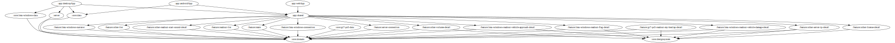

# KoDriver

[](https://github.com/ai-kurou/KoDriver/actions/workflows/on-main-merge.yml)
[](https://codecov.io/gh/ai-kurou/KoDriver)
[](https://qlty.sh/gh/ai-kurou/projects/KoDriver)
[](https://app.codacy.com/gh/ai-kurou/KoDriver/dashboard?utm_source=gh&utm_medium=referral&utm_content=&utm_campaign=Badge_grade)
[](https://sonarcloud.io/summary/new_code?id=ai-kurou_KoDriver)

[](LICENSE)
[](https://github.com/ai-kurou/KoDriver/releases)


Le Mans Ultimate（LMU）の走行情報を Windows TTS でリアルタイムにアナウンスする Compose Multiplatform アプリ。

## 機能

- アナウンスする項目の選択・有効/無効の切り替え
- アナウンス優先度のドラッグ&リオーダー
- Windows TTS でのリアルタイムアナウンス（未実装）

## 動作要件

- Windows 10 以降
- Le Mans Ultimate（インストール済み）

## インストール

[Releases](https://github.com/ai-kurou/KoDriver/releases) から最新の MSI インストーラーをダウンロードして実行してください。

LMU が起動していない状態でアプリを起動しても問題ありません。LMU の起動を検知すると自動的に接続します。

## アーキテクチャ

Kotlin Multiplatform + Clean Architecture のマルチモジュール構成。

```
:app:desktopApp ┬→ :app:shared → :feature:* → :core:domain
                └→ :core:data ────────────────────────↑
                         :feature:* → :core:designsystem
```

| モジュール | 役割 |
|---|---|
| `:app:desktopApp` | デスクトップアプリ エントリーポイント |
| `:app:androidApp` | Android アプリ エントリーポイント |
| `:app:webApp` | Web アプリ（未実装） |
| `:app:shared` | Compose Multiplatform 共通 UI |
| `:core:domain` | リポジトリ抽象・ユースケース |
| `:core:data` | 共有メモリ読み取り・DataStore（JVM / Android） |
| `:core:designsystem` | 共通 Composable コンポーネント |
| `:feature:lmu-connection` | LMU 接続状態の監視 |
| `:feature:readout` | アナウンス設定 UI |
| `:feature:readout-vehicle-approach` | 車両接近アナウンス詳細 UI |
| `:feature:narrator` | 音声再生エンジン（WAV TTS） |
| `:feature:other` | その他画面・ライセンス表示 |
| `:server` | Ktor サーバー（未実装） |

## Contributing

このプロジェクトはプルリクエストを受け付けていません。
[GPL-3.0 ライセンス](LICENSE) の範囲内で自由にフォーク・改変・再配布できます。

## クレジット

このアプリは音声合成ソフトウェア `VOICEVOX` を利用しています。

- VOICEVOX:剣崎雌雄
- VOICEVOX 公式サイト: <https://voicevox.hiroshiba.jp/>
- VOICEVOX ソフトウェア利用規約: <https://voicevox.hiroshiba.jp/term/>
- 剣崎雌雄 利用規約: <https://voicevox.hiroshiba.jp/product/kenzaki_mesuo/>

## ライセンス

[GPL-3.0](LICENSE)

<!-- MODULE-GRAPH-START -->
## Module Graph


<!-- MODULE-GRAPH-END -->
