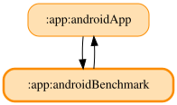

# androidBenchmark

Macrobenchmark（`com.android.test` モジュール）による Baseline Profile 生成用の計装テストモジュール。

## targetProjectPath による app:androidApp 参照について

本モジュールは `targetProjectPath = ":app:androidApp"` で `app:androidApp` を計装対象として参照する。これは Gradle の `implementation`/`api` 依存ではなく AGP 固有のテスト対象指定であり、`moduleGraphAssert` の対象外（`app:.*App` を含む `allowed` パターンにも含まれない、「app モジュール同士は依存しない」という原則の例外として容認された参照、PR #1126）。

AGP は 1 モジュールにつき 1 つの Android プラグインタイプ（application / library / test / dynamic-feature）しか適用できないため、`com.android.test` プラグインを `app:androidApp` 自体に同居させることはできない。Macrobenchmark はテスト APK と計測対象 APK を別プロセスとして起動して計測する仕組みのため、Baseline Profile 生成にはモジュールを分けた `targetProjectPath` 参照が構造的に必須（Google 公式の Baseline Profile モジュールテンプレートも同じ構成）。

<!-- MODULE-GRAPH-START -->
## Module Dependencies

<!-- MODULE-GRAPH-END -->
