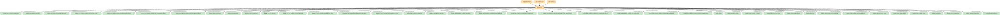

# shared

Android / Desktop / Web の各 `app` から共通利用される、アプリ全体のナビゲーション・画面骨格・`:feature:*` の Koin モジュール束ねを提供するモジュール。`moduleGraphAssert` により `:core:*` へは依存できない（データ層は各 `app` エントリーポイントの composition root で別途束ねる）。

## 主要なファイルの役割

- `AppScreen.kt` / `AppScreenEffects.kt`: アプリ全体のトップレベル画面（ボトムナビゲーション、コネクションバナー等の配置）と副作用処理。
- `AppNavigationState.kt`: アプリ全体のトップレベルナビゲーション状態。
- `OtherContent.kt` / `OtherNavigationState.kt`: 「その他」タブの list/detail 画面。`ReadoutContent.kt`（`feature:readout-list`）と同様に `Material3 Adaptive` の `ListDetailPaneScaffold` と Navigation 3 の `NavBackStack` を組み合わせるパターンを使う（詳細は `docs/list-detail-navigation-pattern.md` を参照）。
- `FeatureModules.kt`: `:feature:*` 各モジュールの Koin モジュールを束ねた `featureModules` リスト。新しい feature モジュールを追加した際はここに追記する。
- `ConnectionBanner.kt` / `ConnectionBannerContent.kt` / `ConnectionBannerNavigation.kt` / `ConnectionBannerSnackbarMessage.kt`: シミュレーター接続状態を示すバナーの表示・タップ時の遷移先解決・Snackbarメッセージ。
- `VersionMismatchBottomSheet.kt` / `VersionMismatchBottomSheetContent.kt`: アプリとサーバーのバージョン不一致時に表示するボトムシート。
- `AppTheme.kt` / `AppThemeMode.kt`: アプリ全体のテーマ（ダイナミックカラー等）適用。プラットフォームごとの実装は `AppTheme.android.kt` 等の expect/actual で分離。
- `DesktopSplashHost.kt`: デスクトップアプリのスプラッシュ画面ホスト。
- `KeepScreenOnEffect.kt` / `KeepScreenOnModifier.*.kt`: 画面の自動スリープ抑止。
- `PredictiveBack.kt`: Android の予測的戻るジェスチャー対応。

<!-- MODULE-GRAPH-START -->
## Module Dependencies

<!-- MODULE-GRAPH-END -->
