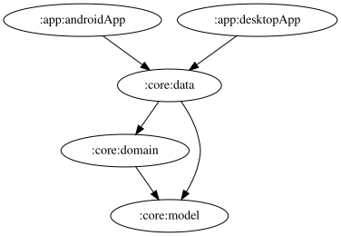

# data

`:core:domain` で定義された Repository インターフェースの実装を提供するモジュール。JVM（デスクトップ）/ Android の両ターゲットを持つ `kotlinMultiplatform` モジュールで、プラットフォーム固有の実装は `androidMain` / `jvmMain` に、共通実装は `jvmAndroidMain` に置く。

## サブパッケージの責務

- `preferences`: Jetpack DataStore（Proto DataStore）によるユーザー設定の永続化。シミュレーター（GT7 PS5 / LMU Windows / ACE Windows）ごと・設定項目ごとに `XxxPreferences`（proto定義）・`XxxPreferencesSerializer`・`XxxPreferencesDataStoreFactory`・`XxxPreferencesRepositoryImpl`・`XxxPreferencesRepositoryFactory` の5点セットを増やしていくパターンを取る。新しい設定項目を追加する際は、既存の類似設定（同じシミュレーター向けのもの）をコピーして書くのが最も安全。
- `websocket`: `:server` が配信する WebSocket エンドポイント（`/ws/<Simulator.id>/<feature>`）に接続し、`Flow` として購読するクライアント側実装。`WebSocketFlowFactory` / `WebSocketHttpClientFactory` が共通の接続処理を担い、`WebSocketXxxRepository` がエンドポイントごとのデシリアライズを担当する。
- `telemetrylog`: Room（`TelemetryLogDatabase` / `TelemetryLogDao` / `TelemetryLogEntity`）によるテレメトリログの永続化。
- `device`: 端末固有機能（ローカルネットワークアクセス許可の確認、触覚フィードバック対応可否）へのアクセス。
- `release`: サーバー・アプリのバージョン情報の取得。`ServerVersionRepository`（`:server` のバージョン確認、Android 版アプリのみ登録。`:server` は Windows デスクトップアプリと同一プロセスで動作するため）は Android では `HttpServerVersionRepository` で `:server` へ HTTP アクセスして取得し、`AppUpdateRepository`（アプリ自体の最新リリース確認）は両プラットフォームで `GitHubAppReleaseRepository` により GitHub Releases API から取得する。
- `feedback`: Sentry User Feedback API へのフィードバック送信（`SentryFeedbackSenderRepository`）。

<!-- MODULE-GRAPH-START -->
## Module Dependencies

<!-- MODULE-GRAPH-END -->
