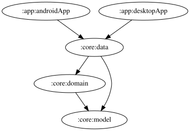

# data

`:core:domain` で定義された Repository インターフェースの実装を提供するモジュール。JVM（デスクトップ）/ Android の両ターゲットを持つ `kotlinMultiplatform` モジュールで、プラットフォーム固有の実装は `androidMain` / `jvmMain` に、共通実装は `jvmAndroidMain` に置く。

## サブパッケージの責務

- `preferences`: Jetpack DataStore（Proto DataStore）によるユーザー設定の永続化。シミュレーター（GT7 PS5 / LMU Windows / ACE Windows）ごと・設定項目ごとに `XxxPreferences`（proto定義）・`XxxPreferencesSerializer`・`XxxPreferencesDataStoreFactory`・`XxxPreferencesRepositoryImpl`・`XxxPreferencesRepositoryFactory` の5点セットを増やしていくパターンを取る。新しい設定項目を追加する際は、既存の類似設定（同じシミュレーター向けのもの）をコピーして書くのが最も安全。
- `websocket`: `:server` が配信する WebSocket エンドポイント（`/ws/<Simulator.id>/<feature>`）に接続し、`Flow` として購読するクライアント側実装。`WebSocketFlowFactory` / `WebSocketHttpClientFactory` が共通の接続処理を担い、`WebSocketXxxRepository` がエンドポイントごとのデシリアライズを担当する。Android の `LmuWindowsBrakeWearRepository` は `WebSocketLmuWindowsBrakeWearRepository` を登録し、`/ws/lmu_windows/brake_wear` から REST API 由来のブレーキ残り厚さを受信する。JSON `null` もそのまま流す。
- `telemetrylog`: Room（`TelemetryLogDatabase` / `TelemetryLogDao` / `TelemetryLogEntity`）によるテレメトリログの永続化。
- `device`: 端末固有機能（ローカルネットワークアクセス許可の確認、触覚フィードバック対応可否）へのアクセス。
- `release`: サーバー・アプリのバージョン情報の取得。`ServerVersionRepository`（`:server` のバージョン確認、Android 版アプリのみ登録。`:server` は Windows デスクトップアプリと同一プロセスで動作するため）は Android では `HttpServerVersionRepository` で `:server` へ HTTP アクセスして取得し、`AppUpdateRepository`（アプリ自体の最新リリース確認）は両プラットフォームで `GitHubAppReleaseRepository` により GitHub Releases API から取得する。
- `feedback`: Sentry User Feedback API へのフィードバック送信（`SentryFeedbackSenderRepository`）。

<!-- MODULE-GRAPH-START -->
## Module Dependencies

<!-- MODULE-GRAPH-END -->

LMU自己ベストラップの自由文言は、共有 `MyBestLapPreferences` のLMU専用 `@ProtoNumber(3) lmuWindowsReadoutText` に保存する。既定値は「自己ベストラップ更新 {laptime}」。GT7の自由文言は番号2 `readoutText` に保存し、ACE自己ベストラップの自由文言は番号4 `aceWindowsReadoutText`（既定値は同じく「自己ベストラップ更新 {laptime}」）に保存する。既存の番号1 `voiceType` はどのシミュレーターも参照しないが、旧データの互換性のため維持する。LMU・GT7・ACEの自由文言は口調を読み取らず、旧口調設定の移行は行わない。シミュレーターごとにDataStoreファイルが分かれているため文言は混在しない。

ACEフラッグ文言は `AceWindowsFlagReadoutTextKey` ごとに既存のフィールドを取得・更新する。
保存ファイルと `AceWindowsFlagReadoutTextPreferences` のフィールド・ProtoNumberは維持し、
他フラッグの保存値を残して対象文言のみ更新する。

## LMUピットタイミング設定

`LmuWindowsPitTimingPreferencesRepository` は予想残り周回数・読み上げ有効状態、
`LmuWindowsPitTimingReadoutTextPreferencesRepository` は予告・直前の読み上げ文言を扱う。
Factoryは両Repositoryの組を返し、Android／DesktopのDIで同じDataStoreを共有する。
既存の保存ファイル・フィールド・ProtoNumberを維持するため、設定移行は不要。

## LMUタイヤ温度設定

`LmuWindowsTyreTemperaturePreferencesRepository` は温度閾値・有効状態・低温警告対象フェーズ、
`LmuWindowsTyreTemperatureReadoutTextPreferencesRepository` は過熱・低温警告の文言を扱う。
Factoryが返す両RepositoryはAndroid／DesktopのDIで1つのDataStoreを共有する。
保存ファイル・フィールド・ProtoNumberを維持するため、設定移行は不要。
