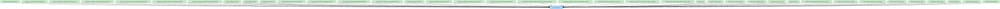

# designsystem

<!-- MODULE-GRAPH-START -->
## Module Dependencies

<!-- MODULE-GRAPH-END -->

## タイポグラフィ

アプリ全体のタイポグラフィは `Typography.kt` の `KoDriverTypography` で一元管理し、`KoDriverTheme` から `MaterialTheme` へ渡している。現時点では Material3 のデフォルトをそのまま採用している。

- 文字スケールやウェイトを調整する場合は `KoDriverTypography` だけを変更する。
- feature モジュール側では `fontSize` / `FontWeight` を直接指定せず、`MaterialTheme.typography.*` のスタイルだけを参照する。
