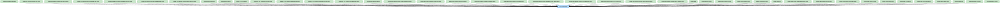

# designsystem

<!-- MODULE-GRAPH-START -->
## Module Dependencies

<!-- MODULE-GRAPH-END -->

## タイポグラフィ

アプリ全体のタイポグラフィは `Typography.kt` の `KoDriverTypography` で一元管理し、`KoDriverTheme` から `MaterialTheme` へ渡している。現時点では Material3 のデフォルトをそのまま採用している。

- 文字スケールやウェイトを調整する場合は `KoDriverTypography` だけを変更する。
- feature モジュール側では `fontSize` / `FontWeight` を直接指定せず、`MaterialTheme.typography.*` のスタイルだけを参照する。

## 配色

配色は `Color.kt` のトーンパレットと `Theme.kt` の `LightColorScheme` / `DarkColorScheme` で定義している。

- 背景・カードなどの surface 系ロールは、わずかに緑寄りの低彩度グレー（`Neutral*` / `NeutralVariant*`）で統一する。Material 3 ベースラインの紫系ニュートラルが混ざらないよう、`surfaceContainerLowest`〜`surfaceContainerHighest`・`surfaceDim`・`surfaceBright`・`inverseSurface` を含めて明示的に指定する。
- ブランド色の蛍光黄緑（`Yellow*`）は primary にのみ使い、選択状態・スイッチ・強調に絞る。secondary は彩度を落としたオリーブ、tertiary はティールとして役割を分ける。
- `app:shared` の `AppTheme.kt` に同じ配色値を複製しているため、配色を変更する場合は両方を同期させる。

## 角丸（Shapes）

角丸は `Shapes.kt` の `KoDriverShapes` で定義し、`Theme.kt` の `KoDriverTheme` から `MaterialTheme` へ渡している。

`large=16dp`・`extraLarge=28dp` は Material3 の既定値と同じ値を明示しており、見た目は変わらない。

- feature モジュール側では `RoundedCornerShape` を直接指定せず、`MaterialTheme.shapes.*` のスタイルだけを参照する。
- `app:shared` の `AppTheme.kt` に同じ角丸値を複製しているため、角丸を変更する場合は両方を同期させる。

## 余白（Spacing）

余白（padding・Spacer・`Arrangement.spacedBy` 等）は `Spacing.kt` の `KoDriverSpacing`（`extraSmall=4dp` / `small=8dp` / `medium=12dp` / `large=16dp` / `extraLarge=24dp`）で定義している。Material3 の `MaterialTheme` には spacing 用のスロットがないため、`KoDriverShapes` のようにテーマへ渡すのではなく、feature モジュール側が `KoDriverSpacing.*` を直接参照する。

- feature モジュール側では 4/8/12/16/24dp の余白値を直接指定せず、`KoDriverSpacing.*` を参照する。
- 読み上げ文言のタイトルと入力欄は `DetailPaneLabeledTextField` の4dp（`extraSmall`）で揃える。挿入チップと説明文の行には下部8dp（`small`）、同じカード内の独立した文言グループ間には16dp（`large`）を確保する。区切り線やカード内部の既存余白も含めて調整し、一律には加算しない。
- ACEの試聴・口調選択チップは `DetailPaneCardChipRow` で折り返しと下部8dpを共通化する。
- アイコンサイズ・カード幅など「余白」ではない寸法（`Modifier.size` 等）は対象外。値がたまたま同じでも `KoDriverSpacing` は使わない。
- `app:shared` は `moduleGraphAssert` で `core:.*` への依存が禁止されているため、`AppSpacing.kt` に同じ余白値を複製している。余白の値を変更する場合は両方を同期させる。
- 4dp グリッドから外れる半端な余白値（18dp・6dp・3dp・10dp 等）の統一は本トークン化のスコープ外（[#1560](https://github.com/ai-kurou/KoDriver/issues/1560) 参照）。

## 文言入力の状態

- `PendingTextState.kt` の `rememberPendingText` は非同期保存中の入力を保持し、保存側UseCaseと同じ `trim().take(MAX)` に正規化した保存値が一致すると保存待ちを解除する。文字数上限は呼び出し側から渡す。
- 連続編集・リセットによる保存待ちを順序付きで保持し、途中の保存値が反映されても最新の入力に巻き戻りが起きないようにする。
- 保存反映が conflate されて観測できない場合も、保存待ちの変更から既定で3秒後に入力を保持したまま解除し、その後の外部更新への追従を再開する。

## 閾値スライダー

- `ThresholdSlider` の `onValueChange` は操作中の表示値を通知する。試聴など兄弟要素で同じ値が必要な画面はPane側で保持し、`value` にも渡す。保存は従来どおり `onValueChangeFinished` で操作完了時に行う。
- `onValueChange` は省略可能で、既存の呼び出し元は内部の表示状態と操作完了時の保存通知をそのまま使用できる。
