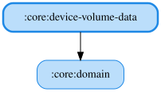

# device-volume-data

端末（OS）のマスター音量を取得・設定するRepositoryを実装するJVM / Androidマルチプラットフォームモジュールです。
KoDriver自体のアナウンス音量設定とは異なり、OS側の再生音量（読み上げが実際に聞こえるかどうかに関わる音量）を扱います。

<!-- MODULE-GRAPH-START -->
## Module Dependencies

<!-- MODULE-GRAPH-END -->
