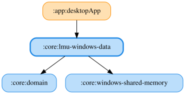

# lmu-windows-data

Le Mans UltimateのWindows共有メモリを読み取り、ドメイン層のRepositoryを実装するJVM専用モジュールです。
共有メモリI/Oの汎用部分は `core:windows-shared-memory` に切り出しており、本モジュールはLMU固有の構造体パースに専念します。

## 車両クラス（mVehicleClass）の取りうる値

Scoring セグメントの `mVehicleClass` (char[32]、オフセット +200) は人間可読なクラス名を返す。
2026年8月時点で実機から確認できた値は以下の通り（今後のアップデートで追加・変更される可能性がある）。

- `GT3`
- `GTE`
- `LMP3`
- `LMP2`
- `LMP2_ELMS`
- `Hyper`

参照: `LmuWindowsMapper.readVehicleClassName`, `LmuWindowsVehicleClassData`

<!-- MODULE-GRAPH-START -->
## Module Dependencies

<!-- MODULE-GRAPH-END -->
