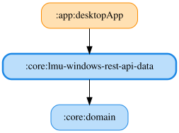

# lmu-windows-rest-api-data

Le Mans Ultimateが内蔵するローカルREST API（`http://localhost:6397`）を利用するためのJVM専用モジュールです。

## 実装済み: 天気予報（`/rest/sessions/weather`）

- `GetLmuWindowsWeatherForecastUseCase`（`:core:domain`）: `LmuWindowsWeatherForecastRepository.weatherForecasts()` を呼び出し、`PRACTICE`/`QUALIFY`/`RACE` 各セッションの `LmuWindowsWeatherForecast`（`START`/`NODE_25`/`NODE_50`/`NODE_75`/`FINISH` ノードごとの気象データ）のリストを返す。
- `LmuWindowsWeatherForecastRepositoryImpl` → `LmuWindowsRestApiWeatherDataSource`（Ktorクライアントで `GET /rest/sessions/weather` を呼び出し、`kotlinx.serialization` でJSONをDTOへパース） → `LmuWindowsRestApiWeatherMapper`（DTOをドメインモデルへ変換）という構成。
- レスポンスの `WNV_SKY` の `stringValue`（空模様の日本語表記）は日本語ロケール時に文字化けするため使用せず、`currentValue`（インデックス値）のみをドメインモデルへマッピングする。
- `WNV_WINDSPEED` の `currentValue` はkm/hと異なる内部単位のため、マッパー内で `× 3.6` してkm/hへ変換する（詳細は [`docs/lmu-windows-rest-api.md`](../../docs/lmu-windows-rest-api.md) を参照）。
- Koinモジュール `lmuWindowsRestApiDataModule`（`core.lmuwindowsrestapidata` パッケージ）でHttpClient・DataSource・Repositoryをバインドする。現時点ではこのモジュールを利用するfeatureが無いため、composition root（`app:desktopApp` の `Main.kt`）へは未登録。

## 想定する依存関係

- `:core:domain`: パース結果を返すドメインモデルの参照・実装先。パースロジックはドメイン層に持ち込まず本モジュール内に隔離する（`:core:lmu-windows-data` と同じ方針）。
- Ktorクライアント（`ktor-client-core` / `ktor-client-okhttp`）: `http://localhost:6397` へHTTP経由でアクセスするため。REST APIは共有メモリとは別レイヤーであり、`:core:windows-shared-memory` には依存しない。
- `kotlinx-coroutines` / `kotlinx-datetime`: ポーリング実装用。
- `koin-core`: DI用。

調査結果・エンドポイント仕様は [`docs/lmu-windows-rest-api.md`](../../docs/lmu-windows-rest-api.md) を参照してください。

<!-- MODULE-GRAPH-START -->
## Module Dependencies

<!-- MODULE-GRAPH-END -->
