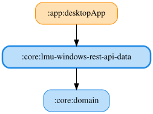

# lmu-windows-rest-api-data

Le Mans Ultimateが内蔵するローカルREST API（`http://localhost:6397`）を利用するためのJVM専用モジュールです。

## 現状

`GET /rest/garage/UIScreen/RepairAndRefuel` から `wearables.brakes`（ブレーキ残り厚さ、4輪、単位: meters）を取得する DataSource（`LmuWindowsRestApiRepairAndRefuelDataSource`）と、ドメインモデル `LmuWindowsBrakeWearData` へ変換する Mapper（`LmuWindowsRestApiBrakeWearMapper`）を実装済み。加えて、`wearables.brakes` を1秒間隔でポーリングする `LmuWindowsRestApiBrakeWearRepository`（`LmuWindowsBrakeWearRepository` の実装）と、Koinモジュール（`lmuWindowsRestApiDataModule`。デスクトップ版のみで束ねる）を実装済み。取得に失敗した周期は `null` を流し、次の周期で再取得する。`:server` は `/ws/lmu_windows/brake_wear` でこのデータを JSON `null` を含めて配信し、Android 版は WebSocket 経由で受信する。

LMU の REST API は `Content-Type: text/plain`（charset なし）で返すため、DataSource はボディを文字列として読み取り自前で JSON デコードする。調査結果・エンドポイント仕様は [`docs/lmu-windows-rest-api.md`](../../docs/lmu-windows-rest-api.md) を参照。

## 想定する依存関係

- `:core:domain`: パース結果を返すドメインモデルの参照・実装先。パースロジックはドメイン層に持ち込まず本モジュール内に隔離する（`:core:lmu-windows-data` と同じ方針）。
- Ktorクライアント（`ktor-client-core` / `ktor-client-okhttp`）: `http://localhost:6397` へHTTP経由でアクセスするため。REST APIは共有メモリとは別レイヤーであり、`:core:windows-shared-memory` には依存しない。
- `kotlinx-coroutines` / `kotlinx-datetime`: ポーリング実装用。
- `koin-core`: DI用。

調査結果・エンドポイント仕様は [`docs/lmu-windows-rest-api.md`](../../docs/lmu-windows-rest-api.md) を参照してください。

<!-- MODULE-GRAPH-START -->
## Module Dependencies

<!-- MODULE-GRAPH-END -->
