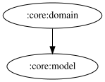

# model

`ReadoutItemKey` / `Simulator` / `TelemetryLog` など、アプリ全体で共有される純粋なドメインモデル（データクラス・sealed
interface・enum とそのシリアライザ）を置くモジュールです。UseCase・Repository 抽象・DataStore 実装などのロジックは
`:core:domain` 側に残し、このモジュールには型定義のみを置きます。

`:core:designsystem` など UI 寄りのモジュールが `:core:domain`（UseCase 等の重い依存）を経由せずにモデルの型を直接
参照できるようにする目的で切り出しています。DataStore 初期値・detail 画面のリセット値・UiState 初期値などで共有される
仕様値定数（`domain/model/*Defaults.kt`）は、アプリケーション固有の仕様値であり純粋なモデルの型定義ではないため、
このモジュールには含めず引き続き `:core:domain` に置きます。

<!-- MODULE-GRAPH-START -->
## Module Dependencies

<!-- MODULE-GRAPH-END -->
