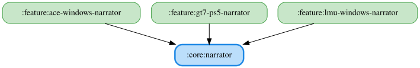

# narrator

WAV 音声を読み上げる narrator feature（`feature:lmu-windows-narrator` / `feature:gt7-ps5-narrator` /
`feature:ace-windows-narrator`）が共通で利用する、WAV 音声再生の基盤モジュールです。

`SoundPlayer` はプラットフォームごとに JVM（`javax.sound.sampled`）/ Android（`SoundPool`）/ Js / WasmJs の
実装を提供します。JVM/Android 実装は Bluetooth A2DP 接続時の音切れ対策（末尾への無音追記・アンロードタイミングの調整）を
含みます。`NarratorErrorCapture` は再生失敗を Sentry（JVM/Android のみ）へ送出する expect/actual です。

`WavNarratorEngine<EVENT, START_TYPE, KEY>` は WAV 読み上げロジックの共通実装です。`:core:domain` の
`SpeechEvent` / `ReadoutStartSoundType` / `ReadoutItemKey` を型パラメータとして受け取る形にすることで、
`:core:narrator` 自体は `:core:domain` に依存しません（`moduleGraphAssert` の `maxHeight` 制約を超えないため）。
イベント→WAVファイルパスのマップ・開始音タイプ→ファイルパスのマップ・WAV を読み込む `resourceLoader`（各 narrator
feature 自身の compose resources `Res::readBytes`）・イベントからキーへの変換関数 `eventToKey` をコンストラクタで
受け取ることで、3つの narrator feature がそのまま利用できます。各 feature は `TextToSpeechEngine` を実装する薄い
アダプタ（`LmuWindowsWavNarratorEngine` など）でこのエンジンをラップします。優先度の高いイベントで割り込む際の
`stop()` → `speak()` の連続呼び出しに対しても、直前にキャンセルした再生ジョブの停止処理が完了するまで新しい再生を
始めないよう `lastCancelledPlayback` で待ち合わせます。

`platformSoundModule(qualifier)` は `SoundPlayer` のプラットフォーム実装を、呼び出し側が指定した Koin の named
修飾子付きでバインドする expect/actual です。3つの narrator feature は同一の Koin コンテナに同時にロードされるため、
`named("lmu_windows")` / `named("gt7_ps5")` / `named("ace_windows")` のように feature ごとに異なる修飾子を渡すことで、
`SoundPlayer` の登録が衝突しないようにしています。

`speakWithPriority<KEY>(...)`（`NarratorPriority.kt`）は、3つの narrator feature の `XxxNarratorEventProcessor` が
共通で利用する優先度判定ロジックです。キュー再生が有効なイベントはそのままキューへ追加し、そうでない場合は現在
再生中のイベントのキーと `readoutOrder` 上の位置を比較して、優先度の高いイベントのみ現在の再生を止めて読み上げます。
`WavNarratorEngine` と同様に `:core:domain` の `SpeechEvent` / `ReadoutItemKey` へ依存しないよう、イベントのキーは
呼び出し側から値として渡し、`speak` / `stop` の実行や現在再生中のキーの取得もラムダで受け取ります。

`TelemetryLogJson`（`TelemetryLogJson.kt`）は、3つの narrator feature が読み上げイベントをテレメトリログとして
保存する際に使う kotlinx.serialization の共通設定（`encodeDefaults` / `explicitNulls`）です。UDP/共有メモリ由来の
Float/Double フィールドが NaN/Infinity を取りうる GT7/ACE では、`Json(TelemetryLogJson) { allowSpecialFloatingPointValues
= true }` のように拡張して利用します。同ファイルの `String.toJsonStringLiteral()` は、`toString()` した状態オブジェクト
などをログ JSON の値としてそのまま埋め込むための文字列エスケープ関数です。

<!-- MODULE-GRAPH-START -->
## Module Dependencies

<!-- MODULE-GRAPH-END -->
