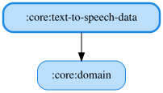

# text-to-speech-data

OS標準の音声合成（TTS）で任意のテキストを読み上げるRepositoryを実装するJVM / Androidマルチプラットフォームモジュールです。
収録済みWAVを再生する`:core:narrator`とは異なり、ラップタイムのように事前収録では表現しきれない動的な文言を
読み上げるための代替手段を提供します。

- jvmMain: PowerShellの`System.Speech.Synthesis.SpeechSynthesizer`経由でWindows標準の音声合成（SAPI）を呼び出す
  `WindowsTextToSpeechRepository`。JVMには音声合成の標準APIが無く、SAPIのCOMインターフェースをJNAで直接扱うには
  型ライブラリのバインディングが必要になるため、1回の読み上げごとにPowerShellプロセスを起動し、読み上げの中断は
  プロセスの破棄で行う（`SapiSpeechSynthesizer`）。非Windowsでは`isAvailable()`が`false`を返し、読み上げも行わない。
- androidMain: `android.speech.tts.TextToSpeech`を使う`AndroidTextToSpeechRepository`。`TextToSpeech`の初期化は
  非同期（`OnInitListener`）で完了するため、最初の読み上げ要求時に初期化の完了を待ち合わせる。初期化失敗時・
  読み上げ言語（既定は日本語）が利用できない場合はエンジンを破棄し、以降の読み上げを行わない。

いずれも`core:domain`の`TextToSpeechRepository`を実装し、`SpeakTextUseCase` / `StopSpeakingUseCase` /
`CheckTextToSpeechAvailableUseCase`から利用されます。

`SapiSpeechSynthesizer`はWindows専用の外部プロセスを起動するためユニットテストの対象外とし、読み上げ制御の
ロジックは差し替え可能な`WindowsSpeechSynthesizer`を介して`WindowsTextToSpeechRepository`側で検証します。

<!-- MODULE-GRAPH-START -->
## Module Dependencies

<!-- MODULE-GRAPH-END -->
