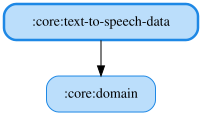

# text-to-speech-data

OS標準の音声合成（TTS）で任意のテキストを読み上げるRepositoryを実装するJVM / Androidマルチプラットフォームモジュールです。
収録済みWAVを再生する`:core:narrator`とは異なり、ラップタイムのように事前収録では表現しきれない動的な文言を
読み上げるための代替手段を提供します。

- jvmMain: PowerShellの`System.Speech.Synthesis.SpeechSynthesizer`経由でWindows標準の音声合成（SAPI）を呼び出す
  `WindowsTextToSpeechRepository`。JVMには音声合成の標準APIが無く、SAPIのCOMインターフェースをJNAで直接扱うには
  型ライブラリのバインディングが必要になるため、1回の読み上げごとにPowerShellプロセスを起動し、読み上げの中断は
  プロセスの破棄で行う（`SapiSpeechSynthesizer`）。非Windowsでは`isAvailable()`が`false`を返し、読み上げも行わない。
  Windowsでは`isAvailable()`が、有効な日本語（`ja-JP`）音声がSAPIに1つ以上あるかをPowerShellで判定する（外部プロセスの
  起動を伴うため、利用できると判明した後は結果を保持する）。利用できない場合、`unavailableReason()`は
  `WindowsSpeechUnavailable`を返し、その他タブにWindowsの音声設定への案内が表示される。非Windowsでは`null`を返す。
- androidMain: `android.speech.tts.TextToSpeech`を使う`AndroidTextToSpeechRepository`。`TextToSpeech`の初期化は
  非同期（`OnInitListener`）で完了するため、最初の読み上げ要求時に初期化の完了を待ち合わせる。初期化失敗時・
  読み上げ言語（既定は日本語）が利用できない場合はエンジンを破棄し、以降の読み上げを行わない。
  利用できない理由は`unavailableReason()`で`EngineMissing`（エンジン未導入・初期化失敗）と`LanguageDataMissing`
  （日本語データ未導入）に区別され、その他タブの案内に使われる。ユーザーがエンジンや日本語データを導入して
  アプリへ戻った場合に案内を消せるよう、`unavailableReason()`の呼び出し時のみ再初期化する（`speak()`や
  `isAvailable()`は利用不可の結果を保持し、読み上げのたびにエンジンを生成し直さない）。

いずれも`core:domain`の`TextToSpeechRepository`を実装し、`SpeakTextUseCase` / `StopSpeakingUseCase` /
`CheckTextToSpeechAvailableUseCase`から利用されます。

Windowsの読み上げは保存済みの`voiceId`を`SelectVoice`へ渡します。未指定なら従来どおり日本語（`ja-JP`）音声を
選び、指定音声が見つからない場合も`SelectVoiceByHints`で日本語音声へフォールバックします。
Androidは`voiceId`を`Voice.name`として検索して`setVoice`で反映します。未指定・音声が見つからない場合・
`setVoice`が失敗した場合は`setLanguage`で既定の日本語音声へ戻します。同じIDは再適用せず、初回未指定時は
初期化済みの言語設定を使います。設定はエンジン全体に残るため、キュー待ちの発話にも新しい声が適用される可能性があります。
スクリプト生成は純粋関数`buildSpeakScript`として切り出し、音声選択・フォールバック・エスケープをテストします。

Windows専用の`WindowsVoiceListRepository`は、有効なSAPI音声のID（`VoiceInfo.Name`）、表示名
（`VoiceInfo.Description`）、言語を取得します。取得はIOスレッド上で排他し、`ja-JP`の音声を含む一覧だけを保持して以降は
再取得しません。非Windows・失敗・15秒のタイムアウト・音声未導入・他言語のみで`ja-JP`の音声を含まない場合は保持せず、
後から音声が導入されても検出できるよう次回に再取得します。
`GetAvailableVoicesUseCase`が`ja-JP`の音声だけに絞り込み、表示名の昇順に並べます。
Androidの`AndroidVoiceListRepository`も登録し、`ja`言語・オフライン可・インストール済みの音声だけを返します。
`engineOrNull`で読み上げ用の`TextToSpeech`を1インスタンス共有し、一覧は再読み込みで導入状態を反映できるよう
キャッシュしません。初期化失敗・一覧がnull・取得例外の場合は空の一覧を返します（キャンセルは再スローします）。
出力の解析は独立した純粋関数としてユニットテストで検証します。

`SapiSpeechSynthesizer`はWindows専用の外部プロセスを起動するためユニットテストの対象外とし、読み上げ制御の
ロジックは差し替え可能な`WindowsSpeechSynthesizer`を介して`WindowsTextToSpeechRepository`側で検証します。

Windowsの音声設定の起動は、jvmMainの`WindowsSpeechSettingsSenderRepository`が担当します。
`rundll32`経由で`ms-settings:speech`を開き、非Windowsでは何もしません。起動時のIOException・
SecurityExceptionはSentryへ記録します。androidMainには、Windowsの音声設定を開けないため
何もしない`AndroidSpeechSettingsSenderRepository`を登録します。どちらも`core:domain`の
`SpeechSettingsSenderRepository`を実装し、`OpenWindowsSpeechSettingsUseCase`から利用されます。

<!-- MODULE-GRAPH-START -->
## Module Dependencies

<!-- MODULE-GRAPH-END -->
