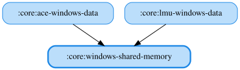

# windows-shared-memory

Windows共有メモリ（`OpenFileMappingA` / `MapViewOfFile`）を読み取る汎用I/O基盤を提供するJVM専用モジュールです。
シミュレーター固有の構造体レイアウトやパースロジックは持たず、`core:lmu-windows-data` / `core:ace-windows-data` など、
Windows共有メモリからテレメトリを取得する各データモジュールに共通の下層基盤として使われます。

<!-- MODULE-GRAPH-START -->
## Module Dependencies

<!-- MODULE-GRAPH-END -->
