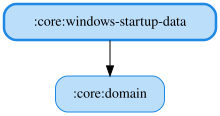

# windows-startup-data

OS起動時にKoDriverを自動起動するかどうかの設定を、Windowsレジストリ（`HKCU\Software\Microsoft\Windows\CurrentVersion\Run`）への登録・解除で実現するJVM専用モジュールです。
レジストリへのアクセスは`Advapi32Util`（JNA）を直接呼び出すため、Windows以外の環境では何もしないNo-Op実装にフォールバックします。

<!-- MODULE-GRAPH-START -->
## Module Dependencies

<!-- MODULE-GRAPH-END -->
