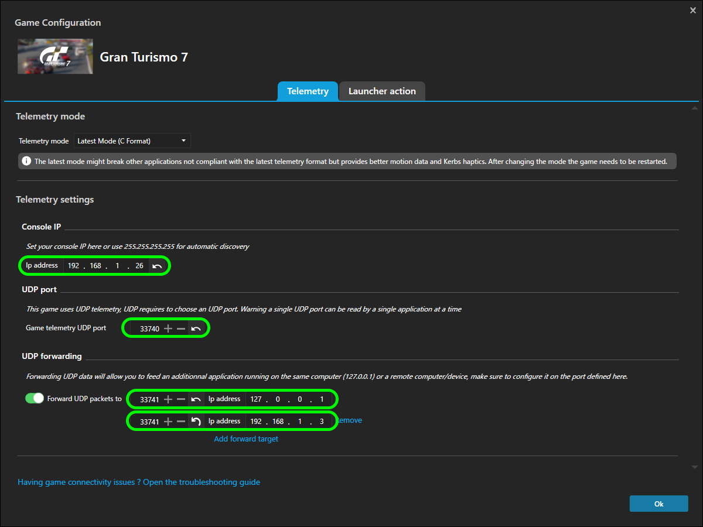

# GT7 (PS5) 接続設定ガイド

> **注意：** PS5は1台のデバイスにのみテレメトリーを送信するため、Android版とWindows版を同時にPS5へ直接接続することはできない。両方を使いたい場合はSimHubを経由する構成（ケース2）を使用すること。

## ケース 1：KoDriver のみをGT7(PS5)に接続する場合

SimHubを含むその他のダッシュボードアプリ等を使用せず、Windows版またはAndroid版KoDriver 1台のみをPS5に直接接続するシンプルな構成。

### 設定手順

1. PS5のIPアドレスを確認する
   - PS5の「設定 → ネットワーク → 接続状態を確認する」からIPアドレスを確認する
2. KoDriverの「その他 → ゲーム機のIPアドレス」にPS5のIPアドレスを入力して保存する

**Windows版の追加手順：**

WindowsファイアウォールでUDP 33740の受信を許可する必要がある。詳細は [windows-install.md](windows-install.md) を参照。

---

## ケース 2：SimHubを利用しながらKoDriverをGT7(PS5)に接続する場合

SimHubがPS5との通信を担い、KoDriverにはSimHubがデータを転送する構成。

### SimHub側の設定

SimHubの Gran Turismo 7 テレメトリー設定を以下のように構成する。



| 項目 | 設定値 |
|---|---|
| Telemetry mode | Latest Mode (C Format) |
| Console IP | PS5のIPアドレス（例: `192.168.1.26`） |
| Game telemetry UDP port | `33740` |
| Forward UDP packets | 有効にする |
| Forward先ポート | `33741` |
| Forward先IPアドレス | KoDriverを実行しているデバイスのIPアドレス（Windows版の場合は `127.0.0.1`） |

### KoDriver Windows側の設定

KoDriverの「その他 → ゲーム機のIPアドレス」に `127.0.0.1` を入力して保存する。

| 項目 | 設定値 |
|---|---|
| ゲーム機のIPアドレス | `127.0.0.1` |

### KoDriver Android側の設定

KoDriverの「その他 → ゲーム機のIPアドレス」にSimHubを実行しているWindowsのIPアドレスを入力して保存する。

| 項目 | 設定値 |
|---|---|
| ゲーム機のIPアドレス | SimHubを実行しているWindowsのIPアドレス（例: `192.168.1.10`） |

### ネットワーク構成の例（Windows版KoDriverの場合）

```
  PS5        : 192.168.1.26
  Windows PC : 192.168.1.10  （SimHubとKoDriver Windowsを実行）

SimHub設定:
  Console IP      : 192.168.1.26  （PS5のIP）
  Forward先IP     : 127.0.0.1
  Forward先ポート : 33741

KoDriver Windows設定:
  ゲーム機のIPアドレス : 127.0.0.1
```

### ネットワーク構成の例（Android版KoDriverの場合）

```
  PS5          : 192.168.1.26
  Windows PC   : 192.168.1.10  （SimHub実行）
  Android端末  : 192.168.1.20  （KoDriver実行）

SimHub設定:
  Console IP      : 192.168.1.26  （PS5のIP）
  Forward先IP     : 192.168.1.20  （AndroidのIP）
  Forward先ポート : 33741

KoDriver Android設定:
  ゲーム機のIPアドレス : 192.168.1.10  （WindowsのIP）
```
