# TinyPedal 完全ガイド

TinyPedal は、レーシングシミュレーター向けの無料・オープンソースのテレメトリオーバーレイアプリケーションである。本ドキュメントは、KoDriver 開発の参考資料として、TinyPedal の機能・表示・使い方を網羅的に解説する。

- 公式リポジトリ: https://github.com/TinyPedal/TinyPedal
- 公式 Wiki(User Guide / FAQ / Appendix): https://github.com/TinyPedal/TinyPedal/wiki
- 本ドキュメントの情報は v2.48.0(2026年7月4日リリース)時点の公式 README・Wiki に基づく。

> **KoDriver との関連**: TinyPedal は LMU の共有メモリへ `pyLMUSharedMemory` でアクセスしており、KoDriver の `:core:lmu-windows-data`(`LmuWindowsMapper`)が参照している ctypes レイアウトと同じデータソースを使う先行事例である。機能設計・データ解釈(燃料計算、デルタタイム、セクタータイム等)の参考になる。

---

## 目次

1. [概要](#概要)
2. [対応環境と必要要件](#対応環境と必要要件)
3. [インストールとセットアップ](#インストールとセットアップ)
4. [基本的な使い方](#基本的な使い方)
5. [プリセット管理](#プリセット管理)
6. [ユーザーファイルと保存データ](#ユーザーファイルと保存データ)
7. [全体設定](#全体設定)
8. [テレメトリ API 設定](#テレメトリ-api-設定)
9. [データモジュール(13種)](#データモジュール13種)
10. [ウィジェット(全74種)](#ウィジェット全74種)
11. [ツール群](#ツール群)
12. [相対給油と絶対給油](#相対給油と絶対給油)
13. [FAQ・トラブルシューティング](#faqトラブルシューティング)
14. [付録データ](#付録データ)
15. [アーキテクチャとライセンス](#アーキテクチャとライセンス)

---

## 概要

TinyPedal は 2022年3月に初版がリリースされ、以降コミュニティ主導で開発が続いているテレメトリオーバーレイである。設計思想として以下を掲げている。

- **ミニマリストデザイン**: 走行の邪魔にならない簡素な表示
- **軽量・高効率**: CPU のみで動作し、データモジュールは高度に最適化されている
- **広範なカスタマイズ性**: 74 種のウィジェットと 13 種のデータモジュールをすべて個別に設定可能
- **データ分析**: 高機能な燃料計算機、ドライバー統計、トラックマップ分析などの編集・分析ツールを同梱

動作の仕組みは「読み取り専用」であり、ゲームに一切干渉しない。

```
[ゲーム API] <---> [共有メモリプラグイン] ---> [共有メモリ] <--- [TinyPedal]
```

1. ゲーム内で共有メモリプラグインを有効化すると、ゲーム API がプラグインへデータを送る
2. プラグインが API データを共有メモリブロックへ書き出す
3. TinyPedal は共有メモリを読み取って画面に表示する(書き込みは行わない)

LMU の REST API アクセスも HTTP GET のみを使用しており、ゲームデータの変更は行わない。

---

## 対応環境と必要要件

### 対応シミュレーター

| API | Windows | Linux |
|:--|:--|:--|
| Le Mans Ultimate(LMU) | プラグイン不要(内蔵 API) | サードパーティプラグインが必要 |
| rFactor 2(RF2) | rF2SharedMemoryMapPlugin が必要 | rF2SharedMemoryMapPlugin(Wine フォーク版)が必要 |

### 対応プラットフォーム

- Windows / Linux(VR はネイティブ非対応。OpenKneeboard 等の外部ツールで投影する)

### ディスプレイモード

ゲームの画面モードは **Borderless(ボーダーレス)または Windowed(ウィンドウ)必須**。Fullscreen(フルスクリーン)ではオーバーレイが表示されない。

### ソースから実行する場合の依存関係

- Python 3.8 / 3.9 / 3.10(PySide6 利用時はコマンドライン引数 `--pyside 6` で新しい Python にも対応)
- PySide2、psutil、pyLMUSharedMemory、pyRfactor2SharedMemory(Linux は追加で pyxdg)

---

## インストールとセットアップ

### Windows(配布バイナリ)

1. [Releases ページ](https://github.com/TinyPedal/TinyPedal/releases)から最新版 ZIP をダウンロードする
2. **システムフォルダやゲームフォルダ以外**(`Program Files` や `rFactor 2` フォルダは不可)のクリーンなフォルダへ展開する
3. `tinypedal.exe` を実行する

バージョン更新・ダウングレードは、新しい ZIP の中身を既存フォルダへ上書き展開するだけでよい。初回起動時に古いユーザー設定は自動でマイグレーションされる(念のため手動バックアップ推奨)。

配布バイナリは GitHub Actions で自動ビルドされており、リリースノートに SHA256 ハッシュが記載されている。アンチウイルスの誤検知が心配な場合はハッシュ検証またはソースからの実行が可能。

### LMU 向けセットアップ

- **Windows**: プラグイン不要。ただしゲーム内 `Settings` → `Gameplay` の `Enable Plugins` を ON にすること
- **Linux**: 内蔵 API を選択できるが、アクセスにはサードパーティプラグインが必要になる場合がある

### rFactor 2 向けセットアップ

1. TheIronWolf 氏の [rF2 Shared Memory Map Plugin](https://github.com/TheIronWolfModding/rF2SharedMemoryMapPlugin) をダウンロードする(Linux は Wine 用フォーク版)
2. `rFactor2SharedMemoryMapPlugin64.dll` を `rFactor 2\Bin64\Plugins` フォルダに置く(`Plugins` フォルダがなければ作成)
3. ゲーム内 `Settings` → `Gameplay` → `Plugins` で DLL を有効化し、**ゲームを再起動**する
4. `CustomPluginVariables.JSON` にプラグインのエントリが生成されない場合は、ゲームの `Support\Runtimes` フォルダにある VC12(Visual C++ 2013)ランタイムをインストールする

### Linux(ソースから実行)

```sh
git clone --recursive https://github.com/TinyPedal/TinyPedal.git
./run.py
```

`sudo ./install.sh` で `/usr/local/` 配下へインストールでき、デスクトップランチャーと `TinyPedal` コマンドが作られる。恒久的な起動引数は `~/.config/TinyPedal/launcher.conf` に `TINYPEDAL_RUN_ARGS="--pyside 6"` のように記述する。

既知の問題:

- KDE でウィジェットがゲームウィンドウの上に表示されない → `Config` メニュー → `Compatibility` の `Bypass Window Manager` を有効化
- デスクトップコンポジット無効時は透過が効かない → ウィンドウマネージャーのコンポジットを有効化

### コマンドライン引数

| 引数 | 説明 |
|:--|:--|
| `-h`, `--help` | 利用可能な引数を表示 |
| `-l`, `--log-level` | ログレベル。`0`: 警告・エラーのみ、`1`: 全ログ(コンソール)、`2`: 全ログ(コンソール+ファイル) |
| `-s`, `--single-instance` | シングルインスタンスモード |
| `-p`, `--pyside` | PySide バージョン選択(例: `--pyside 6`) |

---

## 基本的な使い方

### 起動からオーバーレイ表示まで

1. `tinypedal.exe` を実行すると**システムトレイにアイコン**が常駐する(見当たらない場合は隠れたトレイアイコンを確認)
2. トレイアイコンの右クリックでコンテキストメニューが開く
3. ゲームを起動し、**車両がコースに出るとオーバーレイが自動表示**される。コース外では自動的に隠れる(Auto Hide)。トレイメニューの `Auto Hide` でオン/オフを切り替え可能
4. トレイメニューの `Config` でメインウィンドウ(設定画面)を表示する
5. 終了はトレイメニューまたはメインウィンドウの `Overlay` メニューから `Quit`

### ウィジェットの配置操作

- **Lock Overlay(ロック)**: トレイメニューまたはメインウィンドウの `Overlay` メニューで切り替え。ロック中はウィジェットをクリックできず、ゲームウィンドウからフォーカスを奪わない。位置調整が済んだらロック推奨
- **移動**: アンロック状態でウィジェットをドラッグ
- **グリッドスナップ**: `Ctrl` を押しながらドラッグでスナップ有効(スナップ距離デフォルト 10px、グリッドサイズ デフォルト 8px)
- **センタリング**: ウィジェットを右クリックしてメニューから実行

### メインウィンドウの構成

- **Widget タブ**: 74 種のウィジェットの有効/無効切り替えと個別設定(`Config` ダイアログ)
- **Module タブ**: 13 種のデータモジュールの有効/無効(後述の通り無効化は非推奨)
- **Preset タブ**: プリセット(設定一式)の管理
- **Spectate タブ**: 観戦モード。プレイヤーリストから他ドライバーを選ぶ(または `Anonymous` を選択)と、そのドライバー視点のテレメトリを表示できる。手動リフレッシュあり。**観戦モードが有効のままだと自走時にオーバーレイが出ないので注意**
- **ステータスバー**: High DPI スケーリング(`Scale` ボタン)などのトグル

---

## プリセット管理

プリセットはウィジェット・モジュールの設定一式を JSON 形式で保持し、`TinyPedal\settings` フォルダに保存される。

- **読み込み**: プリセット名をダブルクリック
- **ロック**: プリセット単位でロックし、誤上書きを防止
- **転送(Preset Transfer)**: 設定の一部を別プリセットへコピー
- **自動バックアップ**: JSON 保存時に自動バックアップを生成
- **自動読み込み**: ゲーム(API)ごとに自動で読み込むプリセットを指定可能

### 特殊プリセット(共有設定ファイル)

通常のプリセットとは別に、全プリセット共通で使われる定義ファイルがある。

| ファイル | 内容 |
|:--|:--|
| `brands.json` | 車両名 → ブランド名のマッピング(ブランドロゴ表示に使用) |
| `classes.json` | 車両クラス名・別名・クラス色の定義 |
| `brakes.json` | 車両クラス別のブレーキ故障閾値(mm)とヒートマップ割り当て |
| `compounds.json` | タイヤコンパウンド名・シンボル・ヒートマップ割り当て |
| `heatmap.json` | 温度 → 色のヒートマップ定義 |
| `tracks.json` | トラック情報(ピット位置・ピット速度制限・日出日没時刻など) |
| `shortcuts.json` | ホットキーバインディング |

---

## ユーザーファイルと保存データ

グローバル設定 `config.json` の保存場所:

- **Windows**: `%AppData%\Roaming\TinyPedal`
- **Linux**: `~/.config/TinyPedal`(データは `~/.local/share/TinyPedal/`)

走行データの保存形式:

| データ | 形式・場所 |
|:--|:--|
| ドライバー統計 | `.stats` ファイル(グローバル設定フォルダ) |
| デルタベスト | `.csv`(`deltabest` フォルダ) |
| 燃料消費デルタ | `.fuel` ファイル |
| バーチャルエナジー消費デルタ | `.energy` ファイル |
| セクターベスト | `.sector` ファイル |
| トラックマップ | `.svg` ファイル |
| ペースノート | `.tppn` ファイル |
| トラックノート | `.tptn` ファイル |
| 消費履歴 | CSV(燃料計算機へインポート可能) |
| 車両セットアップ | 自動バックアップ(`enable_auto_backup_car_setup`) |

ユーザーパスは相対パス(TinyPedal フォルダ内)と絶対パス(外部)の両方をサポートし、複数インスタンス間でのデータ共有ができる。

---

## 全体設定

### アプリケーション設定

- 起動時のウィンドウ表示、更新確認、トレイへの最小化
- ウィンドウ位置・サイズの保存
- High DPI スケーリング(2K/4K などの大画面でウィジェットをまとめて拡大する推奨手段)
- 自動プリセット読み込み、グローバルホットキー

### 互換性設定

- Bypass Window Manager(Linux / KDE 用)
- 透明背景設定、ウィンドウ位置補正
- X11 プラットフォームプラグイン指定(Linux)
- VR Compatibility(有効にすると OpenKneeboard 等の外部ツールがオーバーレイウィンドウを検出・投影できるようになる。**これ単体で VR 表示されるわけではない**)

### 単位設定

| 項目 | 選択肢 |
|:--|:--|
| 距離 | メートル / フィート |
| 燃料 | リットル / ガロン |
| オドメーター | km / マイル / メートル |
| 速度 | km/h / mph / m/s |
| 温度 | 摂氏 / 華氏 |
| タイヤ圧 | kPa / psi / bar |

### グローバルフォントオーバーライド

全ウィジェットのフォントを一括変更する。フォント名・サイズ加算値(Font Size Addend)・太さを統一でき、例えば加算値 `+10` でほとんどのウィジェットが約2倍サイズになる。

### 通知設定

ロック済みプリセット読み込み時、観戦モード表示時、ペースノート再生時、ホットキー有効化時などの画面通知を個別に切り替えられる。

### ペースノート再生

ペースノート(コース攻略の音声メモ)を走行位置に合わせて自動再生する機能。

- ファイル名の自動マッチング、音声ファイルパス指定
- グローバルオフセット(メートル単位で再生タイミングを前後にずらす)
- 最大再生時間(デフォルト 10 秒)、キューサイズ(デフォルト 5 ファイル)、音量

### ホットキー(グローバル)

Windows のみ対応(Linux 非対応)。ゲームにフォーカスがあっても効く。割り当て可能な操作:

- オーバーレイの表示/非表示、ロック/アンロック
- API 再起動・切り替え
- プリセット読み込み・切り替え
- 観戦モードの有効/無効
- アプリ再起動・終了
- ウィジェット/モジュールの個別オン・オフ

注意: **ゲームを管理者権限で実行しているとホットキーが効かない**(TinyPedal がキーボード状態を取得できないため)。

---

## テレメトリ API 設定

`Config` メニューの `Telemetry API` ダイアログで設定する。

- `api_name`: 使用する API(LMU / RF2)の選択
- `access_mode`: 共有メモリへのアクセス方式(コピー / ダイレクト)
- `character_encoding`: テキストエンコーディング
- `enable_auto_backup_car_setup`: 車両セットアップの自動バックアップ

### REST API 設定(LMU / RF2)

天候予報・ガレージ情報・ブランド名などの追加データはゲームの REST API(WebUI)から取得する。

- ホストアドレス・URL ポート・接続タイムアウト・リトライ回数
- 取得対象(エネルギー・ガレージ・セッション・車両・天候)の個別有効化
- **ポート番号はゲーム側設定と一致させる必要がある**。LMU は `UserData\player\Settings.JSON`、RF2 は `UserData\player\player.JSON` の WebUI ポート値を確認する
- ファイアウォールやアンチウイルスがローカルネットワークアクセスをブロックしていないことを確認する

---

## データモジュール(13種)

データモジュールはウィジェットが使うデータを裏で計算・記録するコンポーネント。**モジュール間には依存関係があるため、未使用に見えても無効化は非推奨**(例: Fuel Module は Delta Module のラップタイムペースを使い、Vehicles Module は Relative Module のクラス・順位データを使う)。すべて高度に最適化されており、無効化してもパフォーマンス差は体感できない。

| モジュール | 役割 |
|:--|:--|
| Delta Module | ベストラップとのタイム差計算。最小記録距離(推奨 5〜10m)、スムージング(デフォルト 30 サンプル)、ペース計算(6 サンプル平均)を設定可能 |
| Force Module | G フォース・ダウンフォース・制動力の計算。重力加速度値、最大 G 値のリセット遅延、平均 G の算出 |
| Fuel Module | 燃料・バーチャルエナジー消費の追跡と給油量推定。記録距離間隔を設定可能 |
| Hybrid Module | ハイブリッド車のバッテリー・電動モーター監視 |
| Mapping Module | 走行ルートからトラックマップを自動記録・生成(SVG)。Track map / Navigation ウィジェットの元データ |
| Notes Module | ペースノート・トラックノートの読み込みと位置照合 |
| Relative Module | 相対位置・順位・クラス分類の計算 |
| Sectors Module | セクタータイムの計測・ベスト記録 |
| Stats Module | ドライバー統計の記録。車両分類(クラス/ブランド/車両)、クラス別表彰台集計。プレイヤーインデックスオーバーライド無効かつシングルインスタンスモード時のみ記録 |
| Stint Module | ラップ・スティント履歴。最小スティント時間、ピットストップ閾値、コールドラップ除外用のタイヤ温度閾値 |
| Vehicles Module | 車両データの加工(ラップ差分閾値、適応的レース長計算のための完走時間差分閾値) |
| Wheels Module | 車軸回転・タイヤ摩耗・ブレーキ摩耗の監視 |

(上記 12 種に加え、内部基底 `_base` を持つ。)

---

## ウィジェット(全74種)

すべてのウィジェットに共通する設定項目:

- 更新間隔(推奨 10ms 以上)
- 位置、不透明度(0.0〜1.0)
- フォント(名前・サイズ・太さ)、色、テキスト配置、パディング・ギャップ

以下、v2.48.0 のソースコード(`tinypedal/widget/`)に存在する全ウィジェットの一覧と機能。

### オーバーレイの配置イメージ

すべてのウィジェットは個別に有効/無効を切り替え、ドラッグで画面上の任意の位置に配置できる。以下は典型的な配置例。

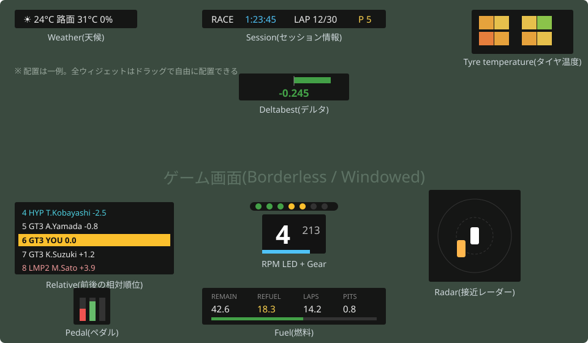

> 以降の表の「図解」列は、各ウィジェットの表示内容を模した**イメージ図**である(実際の画面キャプチャではない)。実際の外観はフォント・色・レイアウト等の設定によって大きく変わる。

### タイミング・順位系

| 図解 | ウィジェット | 表示内容 |
|:--|:--|:--|
| 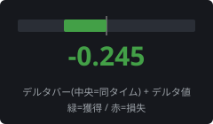 | Deltabest | ベストラップとのリアルタイムタイム差(デルタバー) |
| 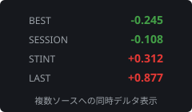 | Deltabest extended | 複数のラップタイムソース(セッションベスト・オールタイムベスト等)に対するデルタ表示 |
| 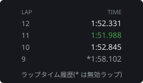 | Lap time history | 過去のラップタイム履歴一覧 |
| 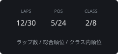 | Laps and position | ラップ数、総合順位、クラス内順位 |
| 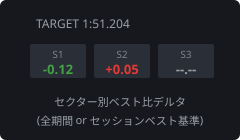 | Sectors | セクタータイム(現在/ベスト比較) |
| 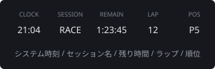 | Session | システム時計、セッション名、残り時間、ラップ数、総合順位 |
| 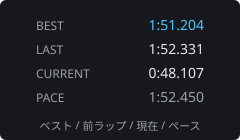 | Timing | ラップタイム情報(現在・ベスト・前ラップ等) |
| 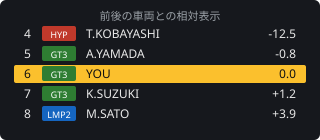 | Relative | 前後の車両との相対順位・ギャップ一覧(いわゆるリラティブ表示) |
| 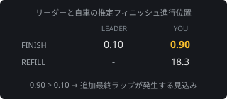 | Relative finish order | リーダーと自車の推定フィニッシュ順序と必要給油量をテーブル表示。レース終盤の「追加最終ラップ」発生予測に使う(詳細は[相対給油と絶対給油](#相対給油と絶対給油)) |
| 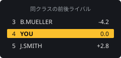 | Rivals | 同クラスの前後ライバルとの順位・比較情報 |
| 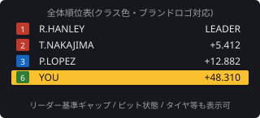 | Standings | 全体順位表(ブランドロゴ表示対応) |
| 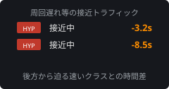 | Traffic | 周回遅れ・接近車両などのトラフィック情報 |
| 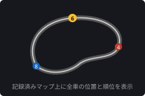 | Track map | 記録済みトラックマップ上に順位・位置を表示(有効な1周の走行記録が必要。未記録時は円形マップ) |
| 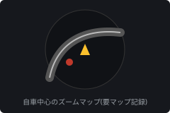 | Navigation | 自車中心のズームナビゲーションマップ(有効な1周の走行記録が必要) |
| 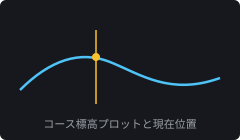 | Elevation | 標高プロット(トラックマップと同時に記録) |
| 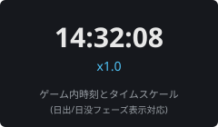 | Track clock | ゲーム内時刻、タイムスケール、日照フェーズ |
| 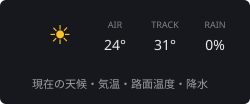 | Weather | 現在の天候情報 |
| 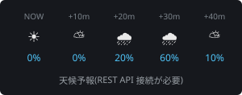 | Weather forecast | 天候予報(REST API 接続が必要) |
| 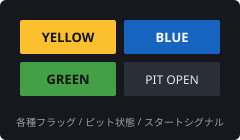 | Flag | 旗(イエロー/ブルー等)、ピット状態、警告、スタートシグナル |
| 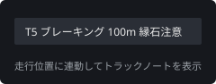 | Track notes | トラックノート(コメント・デバッグ情報) |
| 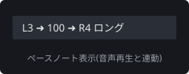 | Pace notes | ペースノートの表示(音声再生と連動) |

### 燃料・エネルギー系

| 図解 | ウィジェット | 表示内容 |
|:--|:--|:--|
| 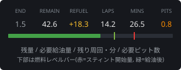 | Fuel | 燃料使用量・残量・必要給油量・必要ピット回数(`pits` / `early` 列) |
| 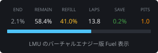 | Virtual energy | バーチャルエナジー(LMU のハイパーカー等)の使用量・残量・補給量 |
| 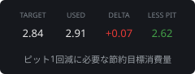 | Fuel energy saver | 燃料またはバーチャルエナジーの節約目標情報 |
| 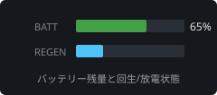 | Battery | バッテリー使用量 |
| 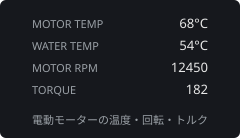 | Electric motor | 電動モーターの使用状況 |
| 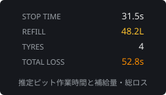 | Pit stop estimate | 推定ピットストップ所要時間と補給量 |
| 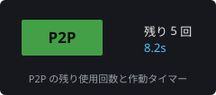 | Push to pass | P2P(プッシュ・トゥ・パス)の使用状況 |
|  | DRS | DRS(リアフラップ)の使用状況 |

### 車両状態・ダメージ系

| 図解 | ウィジェット | 表示内容 |
|:--|:--|:--|
| 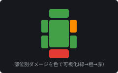 | Damage | 車体ダメージの視覚化(RF2 API の制約で「どのパーツが脱落したか」までは表示不可) |
| 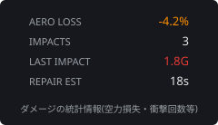 | Damage stats | ダメージ統計 |
| 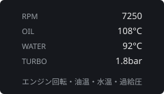 | Engine | エンジン使用状況(回転数・温度など) |
| 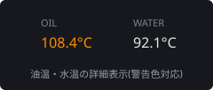 | Engine temperature | 追加のエンジン温度情報(油温・水温) |
| 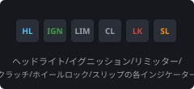 | Instrument | 車両計器情報(ヘッドライト、イグニッション、クラッチ、ホイールロック/スリップ等) |
| 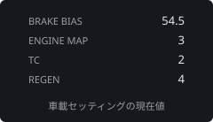 | Onboard setting | 車載設定(ブレーキバイアス等の現在値) |
| 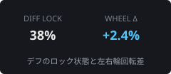 | Differential | デフのロック状態 |
| 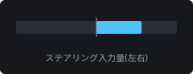 | Steering | ステアリング入力 |
|  | Steering wheel | バーチャルステアリングホイール表示 |
| 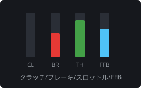 | Pedal | ペダル入力と FFB(フォースフィードバック)情報 |
| 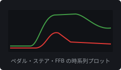 | Trailing | ペダル・ステアリング入力・FFB の時系列プロット(トレース表示) |
| 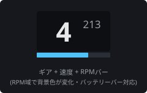 | Gear | ギア、RPM、速度、バッテリー |
| 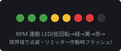 | RPM LED | RPM に連動する LED バー |
| 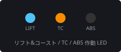 | Lift and coast LED | リフト&コースト、TC/ABS 作動、ホイールスリップ/ロックの LED 表示 |
| 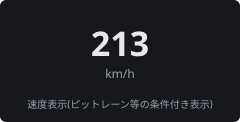 | Speedometer | 条件付き速度表示(ピットレーン速度等) |
| 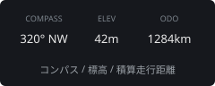 | Cruise | コンパス、標高、オドメーター |
| 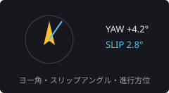 | Heading | ヨー角、スリップアングル、進行方位 |
| 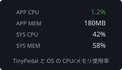 | System performance | TinyPedal 自身と OS の CPU・メモリ使用率(パフォーマンス問題の切り分けに使う) |

### 力学・セットアップ系

| 図解 | ウィジェット | 表示内容 |
|:--|:--|:--|
| 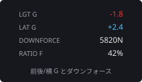 | Force | G フォースとダウンフォース |
| 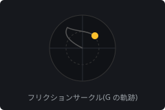 | Friction circle | G フォースの円形ダイアグラム(フリクションサークル) |
| 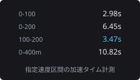 | Acceleration | 指定した速度区間の加速タイム計測 |
| 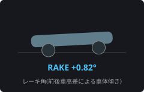 | Rake angle | レーキ角 |
|  | Roll angle | 前後のロール角 |
|  | Ride height | 車高の視覚化 |
|  | Suspension force | サスペンション荷重と比率の視覚化 |
|  | Suspension position | サスペンションポジションの視覚化 |
|  | Suspension travel | サスペンショントラベル |
|  | Weight distribution | 重量配分 |
|  | Wheel camber | キャンバー角 |
|  | Wheel toe | トー角 |

### タイヤ・ブレーキ系

| 図解 | ウィジェット | 表示内容 |
|:--|:--|:--|
|  | Tyre temperature | タイヤ表面温度(内側・中央・外側。ヒートマップ表示対応) |
|  | Tyre inner layer | タイヤ内層温度 |
|  | Tyre carcass temperature | タイヤカーカス温度(LMU の MFD 表示値は表面と内層の中間値のためカーカス温度とは一致しない) |
|  | Tyre pressure | タイヤ空気圧 |
|  | Tyre load | タイヤ荷重と比率の視覚化 |
|  | Tyre wear | タイヤ摩耗率・残り寿命 |
|  | Tyre deflection | タイヤの垂直たわみの視覚化 |
|  | Slip ratio | スリップ率の視覚化 |
|  | Brake bias | ブレーキバイアス |
|  | Brake pressure | ブレーキ圧の視覚化(パーセンテージ) |
|  | Brake temperature | ブレーキ温度(ヒートマップ表示対応) |
|  | Brake wear | ブレーキ摩耗(brakes.json の故障閾値との比較) |
|  | Brake performance | ブレーキ性能情報(制動 G 等) |

### レーダー・履歴系

| 図解 | ウィジェット | 表示内容 |
|:--|:--|:--|
|  | Radar | 周囲の車両レーダー(接近警告。サイズは専用の scale オプションで調整) |
|  | Stint history | スティント履歴(タイヤ・燃料・ラップ数など) |

> 注: ウィジェット名は画面上の表示順ではなくカテゴリ別に整理した。ソースコード上のモジュール名は 74 個(`acceleration`〜`wheel_toe`)。各ウィジェットの全設定項目は公式 User Guide の該当セクションを参照。

---

## ツール群

メインウィンドウの `Tools` メニューから起動する分析・編集ツール。

### 燃料計算機(Fuel Calculator)

レースの必要燃料・エネルギーを計算する高機能ツール。

- **入力**: ラップタイム、タンク容量、ラップあたり消費量、レース時間またはラップ数、ピットストップ平均時間
- **出力**: 総必要燃料/エネルギー、必要ピットストップ回数、タイヤ摩耗寿命、スタート時搭載量
- **実データ連携**: 走行で記録された消費履歴テーブル(CSV)から実測値をインポート可能

### ドライバー統計ビューア(Driver Stats Viewer)

トラック別の走行統計を表示(ソート・フィルター対応)。パーソナルベスト、予選/レース別タイム、走行距離・時間、燃料消費、有効/無効ラップ数、ペナルティ、優勝・表彰台数など。

### 車両ブランドエディタ(Vehicle Brand Editor)

車両名とブランド名のマッピングを編集する。ゲームの REST API からのインポート、JSON ファイルインポート、一括置換に対応。Standings ウィジェットのブランドロゴ表示に必要。

### 車両クラスエディタ(Vehicle Class Editor)

クラス名・別名・クラス色を設定する。セッションからの自動検出、ソート・削除機能あり。

### ブレーキエディタ(Brake Editor)

車両クラス別にブレーキ故障閾値(mm)とヒートマップスタイルを設定する。Brake wear ウィジェットの残量計算に使われる。

### トラック情報エディタ(Track Info Editor)

ピットイン/アウト位置、ピット速度制限、スピードトラップ位置、日出・日没時刻をトラックごとに設定する。

### タイヤコンパウンドエディタ(Tyre Compound Editor)

コンパウンド名・シンボル・色、コンパウンド別のヒートマップ割り当てを設定する。

### ヒートマップエディタ(Heatmap Editor)

温度と色のマッピングを編集する。値オフセット・スケール機能、カスタムプリセット作成、組み込みプリセットのリセットに対応。

### トラックマップビューア(Track Map Viewer)

記録済みの SVG トラックマップを表示・分析する。

- ズーム・パン操作、座標マーキング
- マップ情報(全長・ノード数)、位置情報(XYZ 座標)
- 曲線情報(長さ・勾配・曲率・曲率半径)、勾配情報
- 距離円・中心マーク表示、背景色選択

### トラックノートエディタ(Track Notes Editor)

ペースノート(`.tppn`)・トラックノート(`.tptn`)の作成・編集。GPL Pace Notes 形式(`.ini`)のインポートにも対応。

- メタデータ編集(タイトル・著者・説明)
- 距離位置の設定(マップまたはテレメトリから取得)
- タグ付け(`#pit` 等)、一括オフセット・置換
- マップ上でのハイライト表示

### タイヤ戦略プランナー(Tyre Strategy Planner)

レースのタイヤ戦略を計画する。最大タイヤ数制限、タイヤ交換時間、同一タイヤ再利用の禁止(制限的割り当て)を設定し、コンパウンドをドラッグ&ドロップで各スティントに配置する。トレッド寿命計算と CSV エクスポートに対応。

---

## 相対給油と絶対給油

RF2 は「今の残量に**追加で**何 L 入れるか」(相対給油)、LMU は「タンクを**合計**何 L まで満たすか」(絶対給油)という異なる給油方式を採用しており、TinyPedal は両方の表示に対応している。

```
絶対給油 = 残りラップ数 × ラップあたり消費量
相対給油 = 残りラップ数 × ラップあたり消費量 − タンク残量
```

- 絶対給油表示は Fuel / Relative finish order / Virtual energy の各ウィジェットで `show_absolute_refueling`(または `show_absolute_refilling`)オプションを ON にすると有効になる
- 絶対給油値は走行が進むほど(残りレース距離が減るほど)減少し、相対給油と違って負の値にならない
- **走行中の使い方**: ピットに入るラップの開始時に表示値へ給油量を合わせ、ピット進入直前に最終調整する(調整しなくても最大1ラップ分の余剰で済む)
- **追加ピットの要否**: Fuel ウィジェットの `pits` 列(現スティント終了時にピットした場合の必要回数)/ `early` 列(現ラップ終了時にピットした場合の必要回数)で判断する。または「絶対給油値 > タンク残量」なら追加ピットが必要
- 「ラップ終了時点の絶対給油量」を表示しないのは仕様。ピット入口の位置がトラックごとに大きく異なり(例: セブリング WEC 配置ではフィニッシュラインから約 28% 手前)、誤差が大きすぎるため

### 追加最終ラップの予測(Relative finish order ウィジェット)

時間制レースでは、タイマーが 0 になる直前にリーダーが最終ラップへ入ると、自分にも追加の1周(と燃料)が必要になる。Relative finish order ウィジェットは、リーダーと自車の「タイマー終了時点の推定ラップ進行位置」とラップタイム差を比較し、マルチクラスやピット所要時間も考慮して追加ラップの可能性を予測する。自車の推定進行位置がリーダーより大きければ追加ラップが発生する、という読み方をする。

---

## FAQ・トラブルシューティング

### 表示されない・動かない

| 症状 | 対処 |
|:--|:--|
| オーバーレイが表示されない | ゲームが Fullscreen になっていないか確認(Borderless / Windowed 必須)。必要なプラグインの導入・有効化を確認。Spectate モードが有効のままになっていないか確認 |
| Track map / Navigation にマップが出ない | マップはゲームから提供されず走行ルートから記録される。**ピットアウトラップを除く有効な1周**の完走が必要。Mapping Module が有効か確認 |
| REST API に接続できない / 天候予報が出ない | `Enable RestAPI Access` と対象データのオプションを確認。URL ポートがゲーム設定ファイルの WebUI ポートと一致しているか確認。ファイアウォールを確認 |
| 順位表にブランドロゴが出ない | REST API 接続を確認し、Vehicle Brand Editor でブランドデータをインポート。ロゴ画像ファイルを用意する |
| ホットキーが効かない | ゲームが管理者権限で動いていないか確認 |
| 他ドライバーの燃料が 0 表示 | ゲーム側が対戦相手の燃料情報を意図的に無効化しているため表示不可(仕様) |
| 一部車両でテレメトリが出ない | DLC 等の一部車両はゲーム API 側でデータが無効化されている |
| RF2 で左右タイヤのコンパウンドが同じ表示 | RF2 API が同一車軸の左右別コンパウンド情報を提供しないため(左タイヤの値が使われる) |
| マルチプレイで天候予報・トラック時刻が合わない | ゲーム API の制限でサーバーと同期できない(仕様) |

### パフォーマンス

- ゲームがカクつく場合は、まず **System Performance ウィジェット**で TinyPedal と OS の CPU・メモリ使用率を確認し、原因を切り分ける
- TinyPedal は CPU のみを使用するため **G-Sync と相性が悪い**ことが報告されている(対応不可)
- Windowed / Borderless モードの FPS 安定化: グラフィックドライバ側で最大フレームレートを制限(モニタリフレッシュレート+10 程度)、ゲーム実行ファイルの Fullscreen Optimizations を無効化、ゲーム内 Post Effects を下げる

### その他

- **タブレット等の外部デバイス表示は不可**(ウィジェットは Web ベースではない)
- **OBS でのキャプチャ**: Windows では Display Capture(画面全体キャプチャ)のみ可能。Linux では `Bypass Window Manager` を無効化する
- **ゲームクラッシュの原因になるか**: ならない。共有メモリの読み取りのみでゲームに干渉しない
- **大画面でウィジェットが小さい**: ステータスバーの `Scale`(High DPI Scaling)を有効化、または Global Font Override の Font Size Addend を調整

---

## 付録データ

公式 Wiki の Appendix には、ゲーム内検証に基づく参照テーブルが掲載されている(値はゲームアップデートで変わる可能性あり)。

### LMU トラック日出・日没時刻(抜粋、2026/04/11 更新)

| トラック | 日出 | 日没 |
|:--|:--|:--|
| Circuit de la Sarthe(ル・マン) | 05:50 | 22:02 |
| Circuit de Spa-Francorchamps | 06:25 | 20:50 |
| Fuji Speedway | 06:20 | 18:54 |
| Sebring International Raceway | 07:32 | 19:33 |

(全 14 トラック分は公式 Appendix を参照)

### LMU ブレーキ厚さ(抜粋、単位 mm、2025/11/24 更新)

| クラス / 車両 | 最大(F/R) | 故障閾値(F/R) |
|:--|:--|:--|
| HYPER 499P | 40 / 40 | 25 / 25 |
| HYPER 963 | 32 / 32 | 25 / 25 |
| P2 Oreca | 32 / 32 | 25 / 25 |
| LMGT3(例: AMG) | 35 / 32 | 34 / 31 |

新品ブレーキには ±0.1mm の個体差(Variation)がある。

### ラバーカバレッジとグリップ(LMU / RF2)

| カバレッジ | グリップ | 相当周回数(LMU) | 相当周回数(RF2) |
|:-:|:-:|:-:|:-:|
| 0.0 | グリーン | 0+ | 0+ |
| 0.5 | ミディアム | 1200+ | 600+ |
| 1.0 | 飽和 | 4000+ | 2000+ |

---

## アーキテクチャとライセンス

### 技術構成

- **言語/フレームワーク**: Python(3.8〜3.10)+ PySide2(Qt。`--pyside 6` で PySide6 も選択可)
- **データ取得**: [pyLMUSharedMemory](https://github.com/TinyPedal/pyLMUSharedMemory)(LMU 共有メモリ)、[pyRfactor2SharedMemory](https://github.com/TinyPedal/pyRfactor2SharedMemory)(RF2 共有メモリ)、HTTP GET による REST API アクセス
- **Windows ビルド**: py2exe(GitHub Actions で自動ビルド、SHA256 検証可能)

### ライセンス

- 本体: **GPL v3 以降**(GNU General Public License)
- アイコン・画像(`images` フォルダ): **CC BY-SA 4.0**
- サードパーティライセンスは `docs\licenses\THIRDPARTYNOTICES.txt` に記載

### コミュニティ

- Issue 報告・機能リクエスト・コード貢献: [Contributing Guidelines](https://github.com/TinyPedal/TinyPedal/blob/master/CONTRIBUTING.md)
- コミュニティサポート: [rFactor 2 公式フォーラムのスレッド](https://forum.studio-397.com/index.php?threads/tinypedal-open-source-overlay-for-rf2-pacenotes-radar-ffb-deltabest-relative-fuel-calculator.71557/)
- サードパーティ拡張: [TinyUi](https://github.com/Oost-hash/TinyUi)(モジュラー UI レイヤー)
