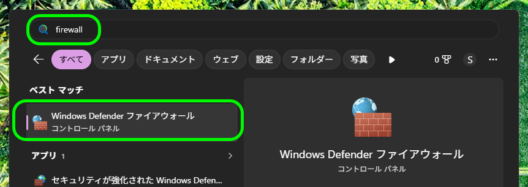
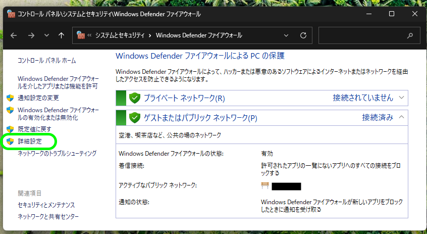
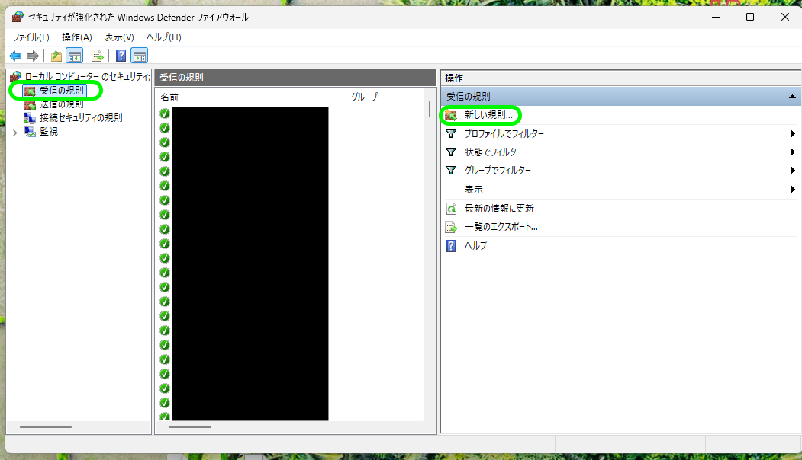
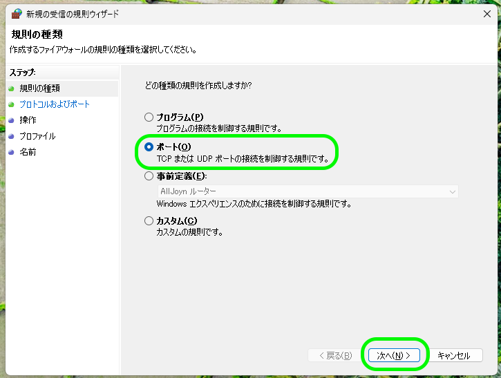
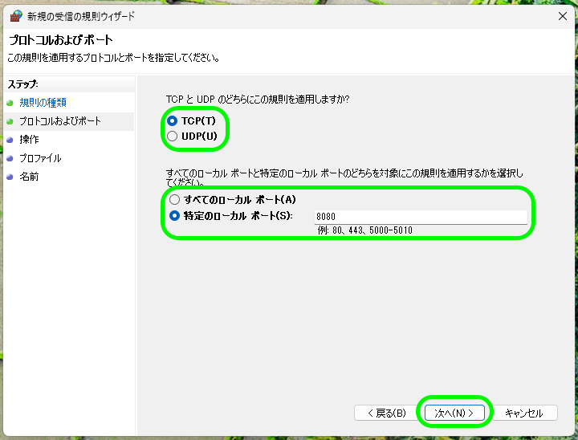
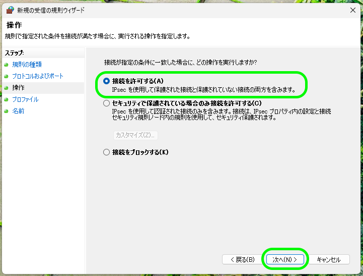
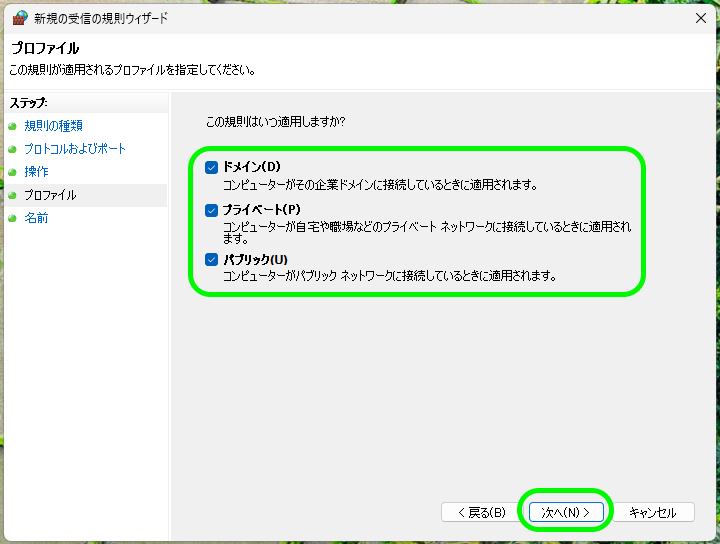
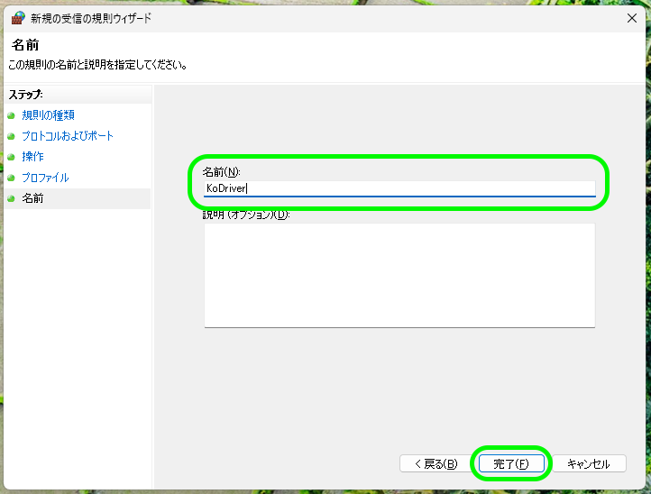

# Windows 版のインストール手順

## インストール

1. [Releases](https://github.com/ai-kurou/KoDriver/releases) から最新の `KoDriver-windows-*.msi` をダウンロードします。
2. ダウンロードした MSI インストーラーを実行します。
3. インストール後、スタートメニューまたはデスクトップショートカットから KoDriver を起動します。

Windows 版 KoDriver をあらかじめ起動しておいてください。LMU が起動すると KoDriver が自動的に接続します。

## Windows SmartScreen の警告

現在配布している Windows 版インストーラーはコード署名されていません。そのため、Windows SmartScreen やブラウザのダウンロード保護で警告が表示される場合があります。

SmartScreen の警告が表示された場合は、配布元がこのリポジトリの [Releases](https://github.com/ai-kurou/KoDriver/releases) であることを確認してください。内容に問題がなければ、警告画面の「詳細情報」から実行できます。

## Android アプリと連携する場合

Android アプリからデスクトップアプリに接続する場合は、Windows PC と Android 端末を同じ LAN に接続してください。

デスクトップアプリは同一プロセス内で KoDriver サーバーを起動し、TCP `8080` 番ポートで待ち受けます。Android 端末から接続できない場合は、Windows ファイアウォールで TCP `8080` の受信が許可されているか確認してください。

このファイアウォール設定は、Android 版アプリから Windows 版デスクトップアプリへ接続する場合のみ必要です。Windows 版デスクトップアプリだけを使う場合は設定不要です。

### Windows ファイアウォールで TCP 8080 の受信を許可する

1. Windows の検索で `firewall` と入力し、「Windows Defender ファイアウォール」を開きます。

   

2. 左側の「詳細設定」を選択します。

   

3. 「受信の規則」を選択し、右側の「新しい規則...」を選択します。

   

4. 「ポート」を選択し、「次へ」を選択します。

   

5. 「TCP」を選択し、「特定のローカル ポート」に `8080` を入力して「次へ」を選択します。

   

6. 「接続を許可する」を選択し、「次へ」を選択します。

   

7. 「ドメイン」「プライベート」「パブリック」を選択したまま、「次へ」を選択します。

   

8. 名前に `KoDriver` と入力し、「完了」を選択します。

   

KoDriver サーバーは認証・暗号化を実装していないため、信頼できる LAN 内でのみ使用してください。

## アンインストール

Windows の「設定」から「アプリ」または「インストールされているアプリ」を開き、KoDriver を選択してアンインストールしてください。

## 既知の制限

- Windows 共有メモリを利用するため、LMU との接続は Windows 版デスクトップアプリでのみ動作します。
- Android アプリ単体では LMU の共有メモリを直接読み取れません。デスクトップアプリとの LAN 接続が必要です。
