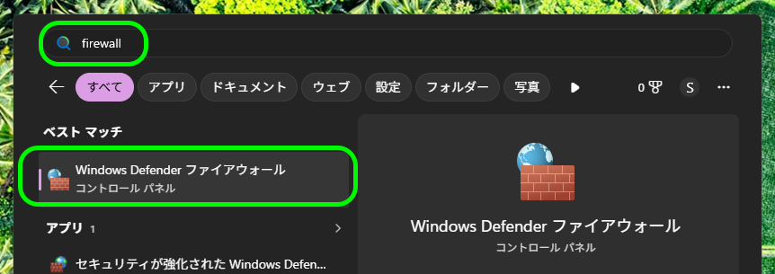
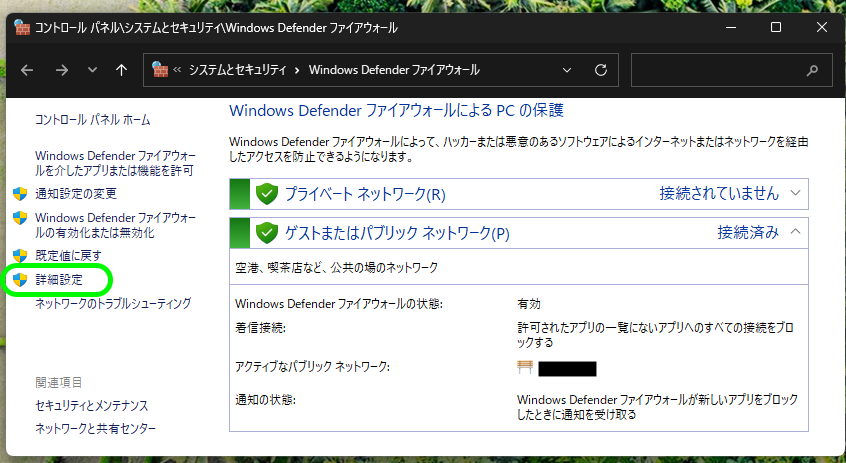
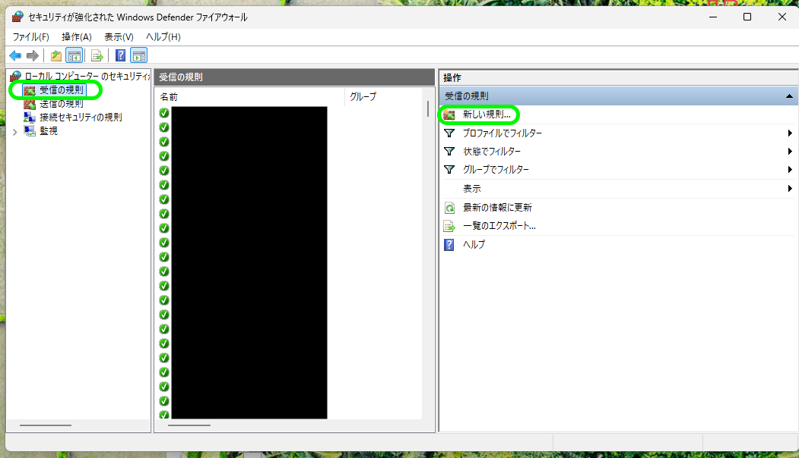
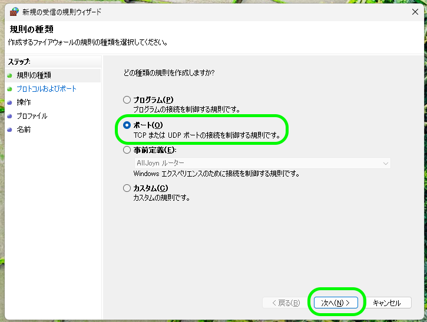
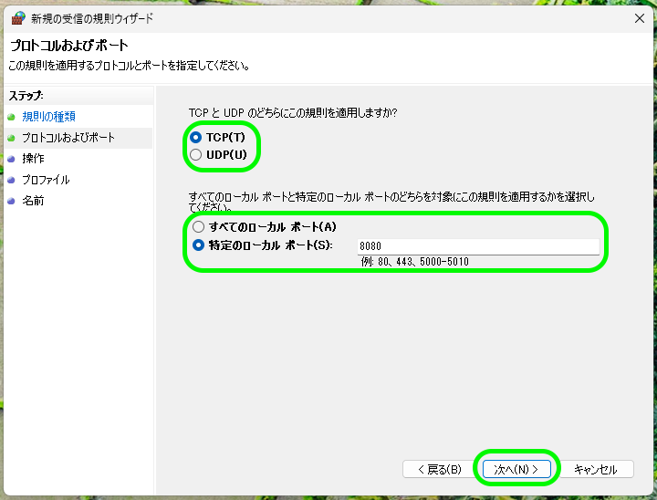
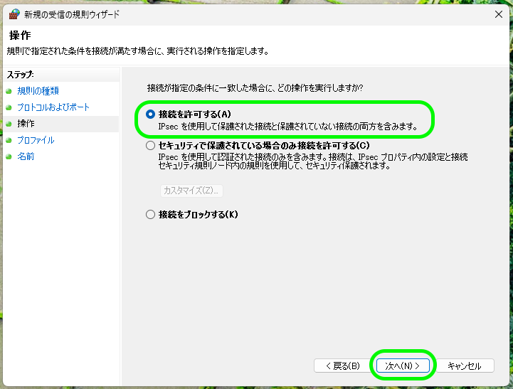
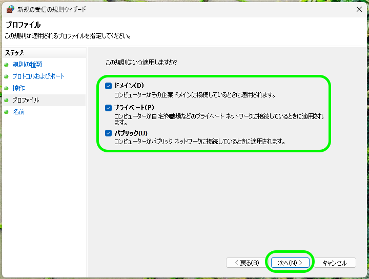
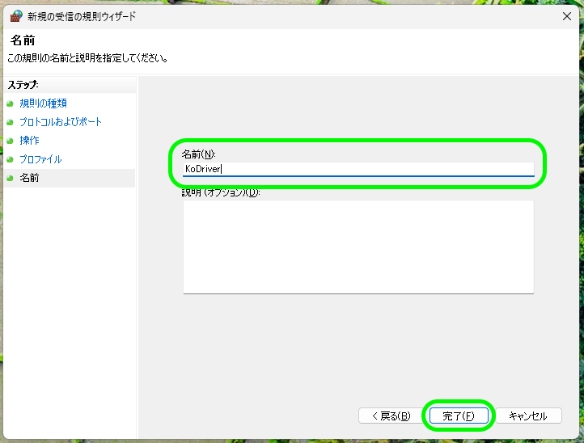

# Windows 版のインストール手順

## インストール

1. [Releases](https://github.com/ai-kurou/KoDriver/releases) から最新の `KoDriver-windows-*.msi` をダウンロードします。
2. ダウンロードした MSI インストーラーを実行します。
3. インストール後、スタートメニューまたはデスクトップショートカットから KoDriver を起動します。

Windows 版 KoDriver をあらかじめ起動しておいてください。LMU または ACE が起動すると KoDriver が自動的に接続します。

## 読み上げ音声の準備

読み上げ本文はすべてWindows標準の音声合成（TTS）を使用するため、日本語音声が必要です。利用できない場合は、KoDriverの「その他 → Windowsの日本語音声を設定」からWindowsの音声設定を開き、日本語音声を追加してください。

「その他 → 読み上げ音声」で使用する音声を選択・試聴できます。音声を追加した後は、読み上げ音声の画面で一覧を再読み込みしてください。

## Windows SmartScreen の警告

現在配布している Windows 版インストーラーはコード署名されていません。そのため、Windows SmartScreen やブラウザのダウンロード保護で警告が表示される場合があります。

SmartScreen の警告が表示された場合は、配布元がこのリポジトリの [Releases](https://github.com/ai-kurou/KoDriver/releases) であることを確認してください。内容に問題がなければ、警告画面の「詳細情報」から実行できます。

## Android アプリと連携する場合

Android アプリからデスクトップアプリに接続する場合は、Windows PC と Android 端末を同じ LAN に接続してください。

Android側で、次の手順で接続先を設定してください。

1. Windows版KoDriverを起動します。
2. Android版KoDriverの「その他 → Windows版KoDriverへ接続するIPアドレス」を開きます。
3. サーバーが検出されると表示される「Windows版KoDriverを選択」ダイアログで接続先を選び、「OK」を押します。閉じた場合は「見つかったWindows版KoDriverを選択」から再度開けます。検出されない場合は、Windows PCのLAN内のIPアドレスを手入力してください。
4. 「保存」を押します。接続できない旨の警告が表示された場合は、IPアドレスとファイアウォール設定を確認してください。

Android 17（API 37）以降では、ローカルネットワークへのアクセス許可も必要です。拒否した場合は「その他 → ローカルネットワークへのアクセス許可」からアプリの設定を開き、許可を変更してください。

デスクトップアプリは同一プロセス内で KoDriver サーバーを起動し、TCP `8080` 番ポートで待ち受けます。Android 端末から接続できない場合は、Windows ファイアウォールで TCP `8080` の受信が許可されているか確認してください。

このファイアウォール設定は、Android 版アプリから Windows 版デスクトップアプリへ接続する場合のみ必要です。Windows 版デスクトップアプリだけを使う場合は設定不要です。

### Windows ファイアウォールで TCP 8080 の受信を許可する

1. Windows の検索で `firewall` と入力し、「Windows Defender ファイアウォール」を開きます。

   

2. 左側の「詳細設定」を選択します。

   

3. 「受信の規則」を選択し、右側の「新しい規則...」を選択します。

   

4. 「ポート」を選択し、「次へ」を選択します。

   

5. 「TCP」を選択し、「特定のローカル ポート」に `8080` を入力して「次へ」を選択します。

   

6. 「接続を許可する」を選択し、「次へ」を選択します。

   

7. 「ドメイン」「プライベート」「パブリック」を選択したまま、「次へ」を選択します。

   

8. 名前に `KoDriver` と入力し、「完了」を選択します。

   

KoDriver サーバーは認証・暗号化を実装していないため、信頼できる LAN 内でのみ使用してください。

## GT7 (PS5) と接続する場合

Windows 版 KoDriver のみを GT7 (PS5) に接続する場合は、Windows ファイアウォールで UDP `33740` の受信を許可する必要があります。SimHub経由で接続する場合は、代わりにUDP `33741` の受信を許可してください。以下の手順のポート番号を `33741` に置き換えます。接続設定は [GT7 (PS5) 接続設定ガイド](gt7-ps5-connection-setup.md) を参照してください。

### Windows ファイアウォールで UDP 33740 の受信を許可する

1. Windows の検索で `firewall` と入力し、「Windows Defender ファイアウォール」を開きます。
2. 左側の「詳細設定」を選択します。
3. 「受信の規則」を選択し、右側の「新しい規則...」を選択します。
4. 「ポート」を選択し、「次へ」を選択します。
5. 「UDP」を選択し、「特定のローカル ポート」に `33740` を入力して「次へ」を選択します。
6. 「接続を許可する」を選択し、「次へ」を選択します。
7. 「ドメイン」「プライベート」「パブリック」を選択したまま、「次へ」を選択します。
8. 名前に `KoDriver GT7` と入力し、「完了」を選択します。

## アンインストール

Windows の「設定」から「アプリ」または「インストールされているアプリ」を開き、KoDriver を選択してアンインストールしてください。

## 既知の制限

- Windows 共有メモリを利用するため、LMU / ACE との接続は Windows 版デスクトップアプリでのみ動作します。
- Android アプリ単体では LMU / ACE の共有メモリを直接読み取れません。デスクトップアプリとの LAN 接続が必要です。
