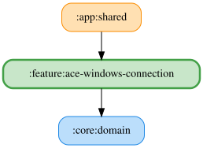

# ace-windows-connection

ACE (Assetto Corsa EVO) Windows版の接続状態監視機能。`feature:lmu-windows-connection` /
`feature:gt7-ps5-connection` に相当する ACE 版。

現時点ではモジュールの雛形のみで、接続監視のロジック（ViewModel・UseCase・UI）は未実装。
`core:ace-windows-data` 側に接続判定（`isConnected()` 相当）が未実装のため、まずはその整備を
含めて別 PR で実装する。

<!-- MODULE-GRAPH-START -->
## Module Dependencies

<!-- MODULE-GRAPH-END -->
