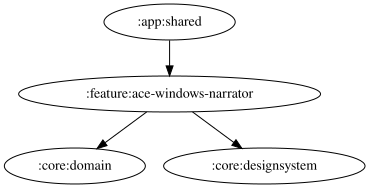

# ace-windows-narrator

ACE (Assetto Corsa EVO) Windows版のWAV音声再生とアナウンス制御。`feature:lmu-windows-narrator` /
`feature:gt7-ps5-narrator` に相当する ACE 版。

`AceWindowsNarratorViewModel` が `ObserveAceWindowsFuelUseCase` の燃料残量と
`ObserveAceWindowsRemainingFuelThresholdPercentageUseCase` の閾値を監視し、
`AceWindowsNarratorEventProcessor` を通じて `SpeechEvent.AceWindowsRemainingFuelWarning` を
`AceWindowsWavNarratorEngine`（`TextToSpeechEngine` 実装）に渡して WAV（`remaining_fuel_caution.wav`）を
再生する。`SoundPlayer` はプラットフォームごとに JVM（`javax.sound.sampled`）/Android
（`MediaPlayer`）の実装を持つ。

<!-- MODULE-GRAPH-START -->
## Module Dependencies

<!-- MODULE-GRAPH-END -->
