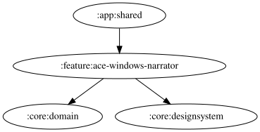

# ace-windows-narrator

ACE (Assetto Corsa EVO) Windows版の開始音WAV再生・自由文言TTSとアナウンス制御。`feature:lmu-windows-narrator` /
`feature:gt7-ps5-narrator` に相当する ACE 版。

`AceWindowsNarratorViewModel` が `ObserveAceWindowsFuelUseCase` の燃料残量と
`ObserveAceWindowsRemainingFuelThresholdPercentageUseCase` の閾値を監視し、
`AceWindowsNarratorEventProcessor` を通じて `SpeechEvent.AceWindowsRemainingFuelWarning` を
`TextToSpeechEngine` 実装の `AceWindowsNarratorEngine`（`:core:narrator` の `NarratorEngine` に委譲する薄いアダプタ）に
渡して、`AceWindowsReadoutTextSpeaker` の自由文言をOS標準TTSで読み上げる。
保存先は `AceWindowsRemainingFuelPreferences` のフィールド2（`readoutText`）、既定文言は「燃料は残り{percent}パーセント」。
`{percent}` は判定時の実残量を四捨五入した整数（0〜100）に置換する。閾値・有効判定は従来どおり。
ACEの自由文言イベントは共通の `ReadoutTextEvent` を実装する。
Processorで解決した本文をイベントの `resolvedText` に保持し、キュー待機中の設定変更後も発話とログを一致させる。
空白・TTS利用不可では開始音も本文も要求せず、空文字と `SKIPPED` をログに保存する。
開始音・優先度・キューは `RemainingFuel.Root` を維持する。`remaining_fuel_caution.wav` は廃止し、WAVフォールバックは行わない。
詳細画面では自由文言の編集・既定値へのリセット・`{percent}` の末尾挿入と未知プレースホルダーの警告を提供する。試聴は画面に表示中の残量閾値を使い、`RemainingFuel.Root` の開始音とOS標準TTSで再生する。空白文言・TTS利用不可・音量ゼロ以下では開始音も本文も再生しない。

燃料残り周回数（`SpeechEvent.AceWindowsRemainingFuelLapsWarning`）も同様に、保存した自由文言をOS標準TTSで読み上げる。
保存先は `AceWindowsRemainingFuelLapsPreferences` のフィールド2（`readoutText`、既定「燃料は残り約{laps}周」）と
フィールド3（`emptyReadoutText`、0周以下用、既定「燃料残り1周未満」）。`{laps}` は判定時の整数周回数に置換する。
Processorで解決した本文を `resolvedText` に保持し、空白・TTS利用不可では開始音も本文も要求せず `SKIPPED` を記録する。
開始音・優先度・キューは `RemainingFuelLaps.Root` を維持する。`remaining_fuel_laps_0.wav`〜`remaining_fuel_laps_5.wav` は廃止し、WAVフォールバックは行わない。
詳細画面では通常文言・0周以下用文言の自由文言編集と既定値へのリセットを提供し、通常文言には `{laps}` の末尾挿入と未知プレースホルダーの警告を表示する。試聴は通常文言を画面に表示中の閾値周回数で置換し、0周以下用文言はそのまま使い、`RemainingFuelLaps.Root` の開始音とOS標準TTSで再生する。空白文言・TTS利用不可・音量ゼロ以下では開始音も本文も再生しない。
イベント別のWAVは持たず、WAVは開始音のみ。開始音のパスは `AceWindowsNarratorModule.kt` で定義する。
`SoundPlayer` 等の音声再生基盤の実装は `:core:narrator` を参照。

Checkered・White・Green・Red・Blue・Yellow・Black・BlackWhite・OrangeCircle・RedYellowStripes の全10種は、`AceWindowsReadoutTextSpeaker` が保存文言（既定値は各SpeechEventのnarratedTextと同じ）を
OS標準TTSで読み上げる。`NarratorEngine` の `customSpeak` 経路を使い、WAVへフォールバックしない。
空白文言・TTS利用不可では本文も開始音も要求せず、テレメトリログに空文字と `SKIPPED` を記録する。
開始音・優先度・キューは `ReadoutItemKey.AceWindows.Flag.Root` を参照する。全フラッグが自由文言のOS標準TTSで、フラッグのWAVは使用しない。
判定時に解決した本文を `resolvedText` に保持し、キュー待機中に設定が変わっても発話とログを一致させる。

車両接近も保存した固定の自由文言を `AceWindowsReadoutTextSpeaker` がOS標準TTSで読み上げる。
判定時に解決した本文を `resolvedText` に保持し、キュー待機中に設定が変わっても発話とログを一致させる。
既定文言は「車両接近」で、既存の車両接近DataStoreのフィールド5に保存する。プレースホルダーはない。
Narratorで都度文言を解決し、空白・TTS利用不可では開始音も本文も要求せず、空文字と `SKIPPED` をログに保存する。
有効判定は `VehicleApproach.Root` と `StartReadout` を維持し、開始音・優先度・キューは `VehicleApproach.Root` を使う。
`vehicle_approach.wav` は廃止し、WAVへのフォールバックは行わない。

タイヤ過熱も保存した自由文言をOS標準TTSで読み上げる。既定文言は「タイヤ過熱 {celsius}度」で、
`AceWindowsTyreTemperaturePreferences` のフィールド3に保存する。`{celsius}` は判定時点の全輪最大カーカス温度を
`roundToInt` で四捨五入した整数に置換する。過熱・解除の判定ロジックは従来どおり。
Processorで解決した本文を `SpeechEvent.AceWindowsTyreOverheat.resolvedText` に保持し、発話とログを一致させる。
空白・TTS利用不可では開始音も本文も要求せず、空文字と `SKIPPED` をログに保存する。
開始音・優先度・キューは `TyreTemperature.Root` を維持し、`tyre_overheat.wav` を廃止する。WAVフォールバックは行わない。

自己ベストラップ更新（`SpeechEvent.AceWindowsMyBestLap`）も保存した自由文言をOS標準TTSで読み上げる。
保存先は共有 `MyBestLapPreferences` の `@ProtoNumber(4) aceWindowsReadoutText`、既定文言は「自己ベストラップ更新 {laptime}」。
`{laptime}` は更新後の `bestLapTimeMs` を「1分23秒456」形式に置換する。旧口調設定（`voiceType`）は読み取らない。
Processorで解決した本文を `resolvedText` に保持し、空白・TTS利用不可では開始音も本文も要求せず `SKIPPED` を記録する。
開始音・優先度・キューは `MyBestLap.Root` を使う。WAVへのフォールバックは行わない。

Koinモジュールは`ObserveVoiceSpeedUseCase`・`ObserveVoicePitchUseCase`を提供し、`:core:data`の`VoiceSpeedPreferencesRepository`・`VoicePitchPreferencesRepository`を消費する。
`SpeakTextUseCase`は試聴・本文の読み上げに保存済み速度・声の高さ（ともに0.5〜2.0、既定1.0）を使用する。

<!-- MODULE-GRAPH-START -->
## Module Dependencies

<!-- MODULE-GRAPH-END -->

自由文言の解決で例外が発生した場合はエラーを記録し、当該イベントの開始音・本文を要求せず、
空文字と `SKIPPED` をテレメトリログに保存する。同じ入力の後続イベントと次回以降の収集は継続する。
`CancellationException` は再スローし、キャンセル後の読み上げ・ログ保存は行わない。
