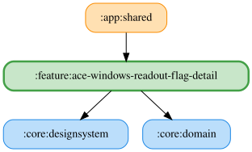

# ace-windows-readout-flag-detail

Checkered・White・Green・Red・Blue・Yellow・Black・BlackWhite・OrangeCircle・RedYellowStripes の全10種のカードは自由文言入力・OS標準TTS試聴・デフォルトに戻す操作を提供する。
文言は `ace_windows_flag_readout_text_preferences.pb` に保存し、有効状態の既存保存先は維持する。
試聴は `Flag.Root` の開始音を使い、空白文言・TTS利用不可・音量0以下では再生しない。
全フラッグが自由文言のOS標準TTSで、WAV試聴チップは使用しない。

文言欄は最新入力の正規化値と保存値が異なる間、古い保存結果による巻き戻りを防ぐ。前後の空白除去・30文字制限後の保存値が一致したら待機を解除し、以降の外部更新を反映する。保存値が変わらない入力でも待機を解除する。編集直後に編集前の保存値へ戻す操作の競合は [#1884](https://github.com/ai-kurou/KoDriver/issues/1884) で別途扱う。

<!-- MODULE-GRAPH-START -->
## Module Dependencies

<!-- MODULE-GRAPH-END -->
