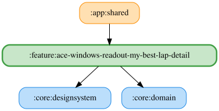

# ace-windows-readout-my-best-lap-detail

<!-- MODULE-GRAPH-START -->
## Module Dependencies

<!-- MODULE-GRAPH-END -->

自己ベストラップ更新の有効/無効と自由文言を設定する。既定文言は「自己ベストラップ更新 {laptime}」。
`{laptime}` 挿入チップ、未知プレースホルダーの警告、既定文言へのリセット、OS標準TTSの試聴を提供する。
試聴は編集中の文言をサンプルタイム83456ms（1分23秒456）に置換し、`MyBestLap.Root` の開始音の後に再生する。
空白文言・TTS利用不可・音量0以下では開始音も本文も再生しない。TTS利用不可の場合は入力・挿入・リセット・試聴を無効にする。
口調選択はGT7・LMU・ACEとも廃止済みで、旧口調設定は参照しない。WAVへのフォールバックは行わない。

試聴中に試聴ボタンを再押しすると停止する。詳細ペインを離れたときも試聴を停止する。
