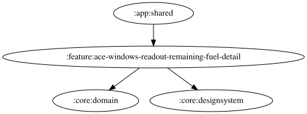

# ace-windows-readout-remaining-fuel-detail

一覧・詳細カードの表示名は「燃料残量」に統一しています。「残量閾値」は燃料の残量割合（%）に対する閾値を指します。

自由文言は `{percent}` に対応する。実際の読み上げでは、警告判定時の燃料残量(%)を四捨五入した整数（0〜100）に置換する。

挿入チップは入力末尾へ `{percent}` を追加し、文字数上限を超える場合とTTS利用不可時は無効になる。未知のプレースホルダーは警告を表示し、そのまま読み上げる。試聴は画面に表示中の残量閾値（スライダーの現在値）を使い、空白・TTS利用不可・音量ゼロ以下では開始音も本文も再生しない。既定文言は「燃料は残り{percent}パーセント」。DataStore の保存済み文言は変更せず、未設定の場合と「デフォルトに戻す」操作で既定文言を使用する。DataStore の移行は不要。

文言欄は `rememberPendingText` で入力を保持し、古い保存結果による巻き戻りを防ぐ。前後の空白除去・30文字制限後の保存値が一致したら待機を解除し、外部更新を反映する。

<!-- MODULE-GRAPH-START -->
## Module Dependencies

<!-- MODULE-GRAPH-END -->
