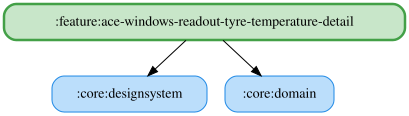

# ace-windows-readout-tyre-temperature-detail

過熱警告の自由文言は `{celsius}` に対応する。実際の読み上げでは、警告判定時の全輪の最高カーカス温度を四捨五入した整数（℃）に置換する。`{wheel}` は未対応。

挿入チップは入力末尾へ `{celsius}` を追加し、文字数上限を超える場合とTTS利用不可時は無効になる。未知のプレースホルダーは警告を表示し、そのまま読み上げる。試聴は画面に表示中の高温閾値（スライダーの現在値）を使い、空白・TTS利用不可・音量ゼロ以下では再生しない。既定文言は「タイヤ過熱 {celsius}度」。DataStore の保存済み文言は変更せず、未設定の場合と「デフォルトに戻す」操作で新しい既定文言を使用する。DataStore の移行は不要。

文言欄は `rememberPendingText` で入力を保持し、古い保存結果による巻き戻りを防ぐ。前後の空白除去・30文字制限後の保存値が一致したら待機を解除し、外部更新を反映する。

<!-- MODULE-GRAPH-START -->
## Module Dependencies

<!-- MODULE-GRAPH-END -->

試聴中に試聴ボタンを再押しすると停止する。詳細ペインを離れたときも試聴を停止する。
