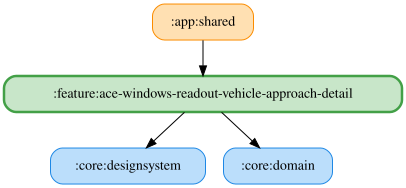

# ace-windows-readout-vehicle-approach-detail

ACEの車両接近の閾値・接近開始時の有効状態・自由文言を設定する詳細ペイン。
閾値スライダーと `StartReadout` スイッチは維持し、既定文言「車両接近」の入力欄・デフォルトに戻すボタン・TTS試聴を提供する。
文言は固定文字列で、プレースホルダーはない。保存時に前後の空白を除去し、`READOUT_CUSTOM_TEXT_MAX_LENGTH` で切り詰める。
非同期保存中は `rememberPendingText` で入力とリセットを保護し、古い保存結果による巻き戻りを防ぐ。
試聴は `VehicleApproach.Root` の開始音の後に入力中の文言をOS標準TTSで読み上げる。
空白・TTS利用不可・音量0以下では開始音も本文も再生しない。TTS利用不可時は入力を無効にして案内する。
WAVへのフォールバックは行わない。

<!-- MODULE-GRAPH-START -->
## Module Dependencies

<!-- MODULE-GRAPH-END -->

試聴中に試聴ボタンを再押しすると停止する。詳細ペインを離れたときも試聴を停止する。
