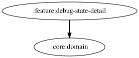

# debug-state-detail

<!-- MODULE-GRAPH-START -->
## Module Dependencies

<!-- MODULE-GRAPH-END -->

## ブレーキ残量カード

ブレーキ温度カードの次に、LMU 専用のブレーキ残量カード（`BRAKE_WEAR`）を表示する。
FL / FR / RL / RR の残量（小数1桁の %）と厚さ（小数3桁の mm）を2列で表示し、欠損した輪は `--` とする。
Android・ACE・GT7、および LMU の取得失敗時は「取得できません」と表示する。
Android は既存の取得不可 Repository を利用するため、WebSocket にブレーキ残量の配信を追加しない。
保存済みのカード順序は維持し、新規カードは末尾に補完する。

## シミュレーター別の状態購読

`LmuWindowsDebugStateSource`・`AceWindowsDebugStateSource`・`Gt7Ps5DebugStateSource` は、各シミュレーターの UseCase 購読・状態変換と受信済みカードの通知を担当する。
LMU の Source は並走時間の追跡と周期的な再計算も担当する。
`DebugStateDetailViewModel` は選択中シミュレーター・カード順序・受信済みカードを管理し、各 Source の StateFlow を `uiState` に組み立てる。

`DebugStateDetailUiState` は、シミュレーター別の入れ子状態（`lmuWindows` / `gt7Ps5` / `aceWindows`）を持つ。
各 Source は自分のシミュレーターの状態を `state` として公開し、ViewModel がヘッダの状態と組み合わせる。
