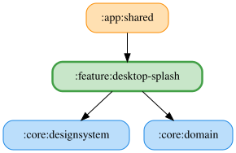

# desktop-splash

デスクトップアプリ起動中に表示するスプラッシュ画面の状態管理を担うモジュール。

JVM の起動から Compose 初期化・Koin モジュール構築・Ktor サーバー起動までには数秒かかるため、その間の初期化フェーズ（[DesktopSplashStep]）を保持・購読するためのプラットフォーム非依存のコアを提供する。

- `DesktopSplashStep` … 初期化フェーズの定義と表示名。
- `DesktopSplashUiState` … スプラッシュ画面の表示状態（現在フェーズ・進捗率）。
- `DesktopSplashProgress` … 起動処理から駆動される進捗状態ホルダー。
- `runInitialization` … 進捗を更新しながら初期化処理を順に実行する `DesktopSplashProgress` 拡張関数。
- `DesktopSplashScreen` … アプリ名・進捗バー・フェーズ名を表示する Composable。

進捗ホルダーは Koin 起動前に生成する必要があるため、DI モジュールは提供せず、`:app:shared` の `DesktopSplashHost` から `DesktopSplashProgress` を直接生成して駆動する。`:app:desktopApp` の `main.kt` は `DesktopSplashHost` に Koin 構築・サーバー起動処理を渡して配線する。

<!-- MODULE-GRAPH-START -->
## Module Dependencies

<!-- MODULE-GRAPH-END -->
