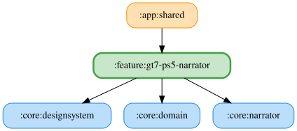

# gt7-ps5-narrator

<!-- MODULE-GRAPH-START -->
## Module Dependencies

<!-- MODULE-GRAPH-END -->

燃料残り周回数は保存した自由文言をOS標準TTSで読み上げる。`{laps}` は推定残り周回数に置換し、
0周以下では燃料なし用の文言を使う。空白文言・TTS利用不可の場合は読み上げず、WAVにはフォールバックしない。
判定時に文言を確定してイベントに保持するため、キュー待機中に設定が変わってもログと発話は一致する。
詳細ペインの試聴は `PlayStartSoundForKeyUseCase` でGT7のナレーターエンジンの開始音を再生した後、
`SpeakTextUseCase` からOS標準TTSで入力文言を再生する。1周以上用の `{laps}` は現在のスライダー閾値に置換し、
燃料なし用の文言はそのまま再生する。空白文言・TTS利用不可・音量ゼロ以下では開始音・本文を再生しない。

燃料残量警告も保存した自由文言をOS標準TTSで読み上げる。既定文言は「燃料は残り{percent}パーセント」。
`{percent}` は実際の残量割合を四捨五入した整数（0..100）に置換する。警告判定と有効状態は既存どおりで、
開始音・優先度・キューは `RemainingFuel.Root` を使う。文言は判定時に確定してイベントとログに保持する。
空白・TTS利用不可では開始音・本文を要求せず、空文字と `SKIPPED` をログに記録し、WAVへはフォールバックしない。
燃料残量の詳細ペインで自由文言を設定でき、試聴は現在の閾値をサンプル残量として `{percent}` に置換してTTSで再生する。
空白文言・TTS利用不可・音量0以下では本文も開始音も再生しない。開始音は `RemainingFuel.Root` を参照する。

タイヤ過熱警告は自由文言のOS標準TTSのみを使用する。既定文言は「タイヤ過熱 {celsius}度」。
`{celsius}` は判定時の全輪の最高タイヤ温度を整数に丸めた摂氏に置換し、解決文言をイベントの
`resolvedText` に保持するためキュー待機中も発話とログが一致する。判定条件・閾値・ヒステリシスは従来どおり。
空白文言・TTS利用不可では開始音も本文も要求せず、空文字と `SKIPPED` を記録する。
`tyre_overheat.wav` は使用せず、WAVへのフォールバックは行わない。開始音・優先度・キュー設定は
`TyreTemperature.Root` を参照する。詳細画面の試聴は現在の高温閾値をサンプル温度として同じキーの開始音とTTSで再生する。

自己ベストラップ更新は保存した自由文言をOS標準TTSで読み上げる。既定文言は「自己ベストラップ更新 {laptime}」。
`{laptime}` は判定時の更新後の `bestLapTimeMs` を「1分23秒456」の形式に置換する。1分未満では分を省略し、
ミリ秒は3桁固定、60分以上も時間にせず分で表す。解決した文言は `resolvedText` に保持し、キュー待機中も発話とログを一致させる。
判定条件と `MyBestLap.Root` / `DetailEnabled` の有効状態は従来どおり。開始音・優先度・キューは `MyBestLap.Root` を参照する。
空白文言・TTS利用不可では開始音も本文も要求せず、空文字と `SKIPPED` を記録する。formal/casual の収録WAVは削除し、
WAVへフォールバックしない。共有protoの `voiceType` はLMU/ACEと旧データの互換性のため残し、GT7のみ `readoutText` を使用する。
