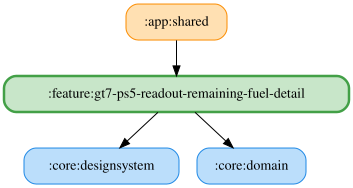

# gt7-ps5-readout-remaining-fuel-detail

GT7 PS5 の燃料残量アナウンス詳細設定を提供する feature モジュールです。
読み上げ一覧の「燃料残量」項目から表示され、燃料残量が指定した割合以下になった場合に
警告を読み上げるための閾値を設定します。

## Responsibilities

- `Gt7Ps5ReadoutRemainingFuelDetailPane` で説明、プレビュー、残量閾値スライダーを表示する
- `Gt7Ps5ReadoutRemainingFuelDetailViewModel` で閾値の購読と保存を扱う
- 閾値のデフォルト値は `GT7_PS5_REMAINING_FUEL_THRESHOLD_PERCENTAGE_DEFAULT` を参照する

## Related Modules

- `:core:domain`: 閾値のデフォルト値、Repository interface、UseCase
- `:core:data`: DataStore を使った Repository implementation
- `:feature:gt7-ps5-narrator`: 閾値を使った読み上げ判定
- `:app:shared`: 読み上げ一覧から detail pane へ遷移

一覧・詳細カードの表示名は「燃料残量」に統一しています。「残量閾値」は燃料の残量割合（%）に対する閾値を指します。

試聴はWAVからOS標準TTSに変更し、現在の閾値をサンプル残量として文言の `{percent}` に置換します。
保存した文言が空白またはTTS利用不可なら読み上げず、WAVにはフォールバックしません。
文言入力欄などのUIはPR2で変更予定です。

<!-- MODULE-GRAPH-START -->
## Module Dependencies

<!-- MODULE-GRAPH-END -->
