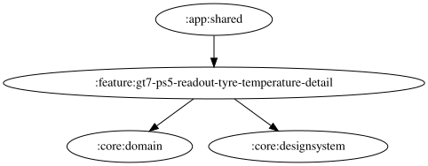

# gt7-ps5-readout-tyre-temperature-detail

GT7 PS5 のタイヤ温度アナウンス詳細設定を提供する feature モジュールです。
読み上げ一覧の「タイヤ温度」項目から表示されます。

## Responsibilities

- `Gt7Ps5ReadoutTyreTemperatureDetailPane` でタイトル・説明・過熱警告の有効/無効・高温閾値の設定 UI を表示する
- 高温閾値（スライダー）・過熱警告の有効/無効はいずれも DataStore に永続化され、Narrator の読み上げ判定にも反映される

## Related Modules

- `:core:designsystem`: 共通 Composable コンポーネント（`DetailPaneDescription` / `DetailPaneCard`）
- `:app:shared`: 読み上げ一覧から detail pane へ遷移

<!-- MODULE-GRAPH-START -->
## Module Dependencies

<!-- MODULE-GRAPH-END -->
