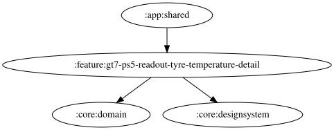

# gt7-ps5-readout-tyre-temperature-detail

GT7 PS5 のタイヤ温度アナウンス詳細設定を提供する feature モジュールです。
読み上げ一覧の「タイヤ温度」項目から表示されます。

## Responsibilities

- `Gt7Ps5ReadoutTyreTemperatureDetailPane` でタイトル・説明・過熱警告の有効/無効・高温閾値・読み上げ文言の設定 UI を表示する
- 高温閾値（スライダー）・過熱警告の有効/無効・文言はいずれも DataStore に永続化され、Narrator の読み上げ判定にも反映される

高温閾値のデフォルト値とリセット値は100℃です。保存データに閾値が明記されている場合はその値を使用し、省略されている場合は100℃として読み込みます。旧デフォルト値95℃を復元する互換処理は行いません。

既定文言は「タイヤ過熱 {celsius}度」。`{celsius}` は判定時の全輪の最高タイヤ温度を整数に丸めた摂氏に置換する。
入力欄は最大 `READOUT_CUSTOM_TEXT_MAX_LENGTH` 文字で、保存時に前後の空白を除去する。
リセット・試聴・`{celsius}` 挿入チップ・未知プレースホルダーの警告を提供する。
試聴は現在の高温閾値をサンプル温度として置換し、`TyreTemperature.Root` の開始音の後にOS標準TTSで再生する。
警告スイッチがOFFでも編集・試聴できる。空白文言・TTS利用不可・音量ゼロ以下では開始音も本文も再生しない。
WAVへのフォールバックは行わない。

## Related Modules

- `:core:designsystem`: 共通 Composable コンポーネント（`DetailPaneDescription` / `DetailPaneCard`）
- `:app:shared`: 読み上げ一覧から detail pane へ遷移

<!-- MODULE-GRAPH-START -->
## Module Dependencies

<!-- MODULE-GRAPH-END -->
