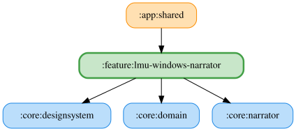

# lmu-windows-narrator

LMUの4種類のフラッグ本文と車両接近開始時・継続時の左右文言とバーチャルエナジー・タイヤ摩耗由来のピットタイミング警告は、保存した自由文字列をOS標準TTSで読み上げる。
空白文言またはTTS利用不可時は本文を読み上げず、収録WAVへのフォールバックは行わない。
開始音は既存の設定に従う。

<!-- MODULE-GRAPH-START -->
## Module Dependencies

<!-- MODULE-GRAPH-END -->

フラッグ・車両接近開始時・継続時のテレメトリログには、読み上げ要求時点の自由文字列を記録する。空欄・TTS利用不可の場合は本文を要求せず、空文字と `SKIPPED` を記録する。`SPOKEN` / `QUEUED` は再生要求の結果であり、非同期発話の完了を保証しない。

`LmuWindowsReadoutTextSpeaker` が各設定の最新文言を取得し、OS標準TTSへ渡す。
車両接近開始時・継続時の既定文言は左「カーレフト」、右「カーライト」。継続時は左側車両「キープライト」、右側車両「キープレフト」。旧開始時・継続時の種別は移行せず、既定文言を使用する。保存時は前後の空白を除去し、30文字までに制限する。

ピットタイミングの両ソースの警告は、残り1周以上で通常文言の `{laps}` を置換し、0周以下で専用文言を使う。空白・TTS利用不可時は開始音も要求せず、空文字と `SKIPPED` を記録する。通常・切迫時文言はピットタイミング詳細画面で設定・試聴できる。通常文言の試聴は `{laps}` を5周に置換し、切迫時文言はそのまま読む。両ソースとも自由文言TTSを使用し、ピットタイミング用の収録WAVは使用しない。
