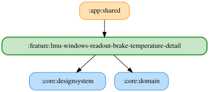

# lmu-windows-readout-brake-temperature-detail

ブレーキ過熱警告を自由文言のOS標準TTSで読み上げる。既定文言は「ブレーキ温度{celsius}℃以上」。文言は全車両クラス共通で、既存の車両クラス別閾値スライダーは維持する。`{celsius}` は実測温度ではなく選択中の車両クラスの設定閾値（℃）へ置換する。

文言は既存の車両クラス別ブレーキ温度Preferencesへ保存し、保存時に前後の空白を除去して30文字に制限する。挿入チップ・未知プレースホルダー警告・デフォルトへ戻すボタンを提供する。試聴は編集中の文言と現在の閾値を解決した `SpeechEvent.BrakeOverheat` を使う。空白文言・TTS利用不可・音量ゼロ以下では再生しない。収録WAVへのフォールバックは行わない。

<!-- MODULE-GRAPH-START -->
## Module Dependencies

<!-- MODULE-GRAPH-END -->
