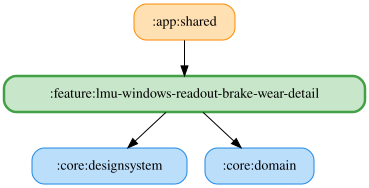

# lmu-windows-readout-brake-wear-detail

LMU のブレーキ摩耗アナウンスの詳細設定画面。有効スイッチ、読み上げ文言（`{percent}` で閾値を埋め込み、試聴可）、車両クラス別の残量閾値スライダーを持つ。あわせて、LMU 内蔵 REST API の `wearables.brakes`（`/rest/garage/UIScreen/RepairAndRefuel`）から取得したブレーキ残り厚さを、4輪（FL, FR, RL, RR）それぞれの残量%と厚さ（mm）で表示する。

残量%は「新品時の厚さ」と「破損厚さ」の間のどこにあるかで計算する。REST API は新品時の厚さを返さないため、観測した最大の厚さを新品時の厚さとみなす（ブレーキ交換で増えれば更新、車両クラスが変わると取り直す）。破損厚さは車両クラスごとの固定値（`:core:domain` の `LmuWindowsBrakeFailureThicknessDefaults.kt`）。摩耗済みの状態で観測を始めると、その時点の厚さが100%になる。

REST API は LMU を起動した Windows 機の `localhost` にしか待ち受けないため、値を取得できるのはデスクトップ版のみ。Android や LMU 未起動時は「取得できません」と表示する。

読み上げ判定は `:feature:lmu-windows-narrator` の `determineBrakeWearLow` が行う（いずれかの輪の残量が閾値以下になった時点で1回、全輪が閾値を超えるまで再読み上げしない）。設定は `:core:data` の `LmuWindowsVehicleClassBrakeWearPreferences` に保存する。エンドポイント仕様は [`docs/lmu-windows-rest-api.md`](../../docs/lmu-windows-rest-api.md) を参照。

<!-- MODULE-GRAPH-START -->
## Module Dependencies

<!-- MODULE-GRAPH-END -->
