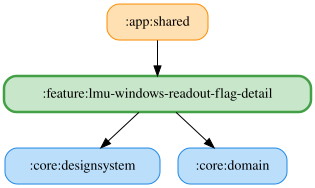

# lmu-windows-readout-flag-detail

LMUの4種類のフラッグ本文は、保存した自由文字列をOS標準TTSで読み上げる。
空白文言またはTTS利用不可時は本文を読み上げず、収録WAVへのフォールバックは行わない。
開始音は既存の設定に従う。フラッグ以外の収録音声には影響しない。

文言欄は最新入力の正規化値と保存値が異なる間、古い保存結果による巻き戻りを防ぐ。前後の空白除去・30文字制限後の保存値が一致したら待機を解除し、以降の外部更新を反映する。保存値が変わらない入力でも待機を解除する。編集直後に編集前の保存値へ戻す操作の競合は [#1884](https://github.com/ai-kurou/KoDriver/issues/1884) で別途扱う。

Koinモジュールは`ObserveVoiceSpeedUseCase`を提供し、`:core:data`の`VoiceSpeedPreferencesRepository`を消費する。
`SpeakTextUseCase`は試聴・本文の読み上げに保存済み速度（0.5〜2.0、既定1.0）を使用する。

<!-- MODULE-GRAPH-START -->
## Module Dependencies

<!-- MODULE-GRAPH-END -->

試聴中に試聴ボタンを再押しすると停止する。詳細ペインを離れたときも試聴を停止する。
