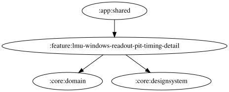

# lmu-windows-readout-pit-timing-detail

文言欄は最新入力の正規化値と保存値が異なる間、古い保存結果による巻き戻りを防ぐ。前後の空白除去・30文字制限後の保存値が一致したら待機を解除し、以降の外部更新を反映する。保存値が変わらない入力でも待機を解除する。編集直後に編集前の保存値へ戻す操作の競合は [#1884](https://github.com/ai-kurou/KoDriver/issues/1884) で別途扱う。

<!-- MODULE-GRAPH-START -->
## Module Dependencies

<!-- MODULE-GRAPH-END -->

バーチャルエナジー・タイヤ摩耗それぞれの通常（残り1周以上）文言とピットイン必須（残り1周未満）文言を設定・試聴できる。通常文言の `{laps}` は予想残り周回数に置き換わり、試聴では5周を使う。ピットイン必須文言は置換せずそのまま読み上げる。

文言は30文字まで。4つの文言欄には「デフォルトに戻す」ボタンがあり、編集した文言をそれぞれの既定値に戻せる。既定値と同じ場合はリセットできない。通常文言の `{laps}` 挿入ボタンは、追加後に30文字を超える場合は無効になる。未知の `{...}` は通常文言だけ警告し、入力内容は維持する。空欄では読み上げず、OS標準TTSを利用できない端末では入力・試聴・リセットを無効にする。音量0では開始音も本文も試聴しない。

両ソースとも自由文言TTSを使用し、ピットタイミング用の収録WAVは使用しない。試聴の開始音は `ReadoutItemKey.LmuWindows.PitTiming.Root` の設定を共用する。

ピットタイミングの判定対象はバーチャルエナジーとタイヤ摩耗であり、リットル単位の燃料残量は含まない。バーチャルエナジー残量警告（残量%の閾値判定）とは異なり、直近に完走したラップの消費量から予想残り周回数を求める。バーチャルエナジー残量の増加やタイヤ交換を検出したラップは消費量の計算に使わず、その後に補充・交換なしで完走したラップの消費量を推定基準として採用する。
