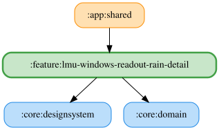

# lmu-windows-readout-rain-detail

LMU の降雨予報を読み上げる機能の詳細設定画面。

説明文のみを表示する静的な画面。降雨予報はセッション開始時に読み上げられる想定で、現時点ではスイッチ・永続化は持たない。listPane のスイッチ（読み上げON/OFF）・開始音・キューの有効状態は `:feature:readout-list` が使う既存の汎用 Repository（`ReadoutPreferencesRepository` / `ReadoutStartSoundEnabledPreferencesRepository` / `QueuePreferencesRepository`）で永続化される。

Narrator側の実際の読み上げ判定ロジックへの配線（降雨検知のデータソース連携含む）は未実装（#1500）。

<!-- MODULE-GRAPH-START -->
## Module Dependencies

<!-- MODULE-GRAPH-END -->
