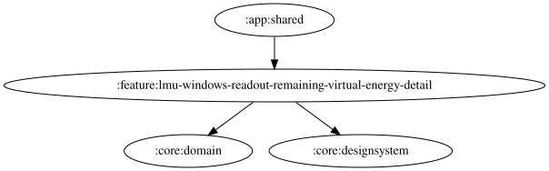

# lmu-windows-readout-remaining-virtual-energy-detail

LMU のバーチャルエナジー残量を読み上げる機能の詳細設定画面。現時点では空の detailPane を表示するのみで、設定項目は持たない。

<!-- MODULE-GRAPH-START -->
## Module Dependencies

<!-- MODULE-GRAPH-END -->
