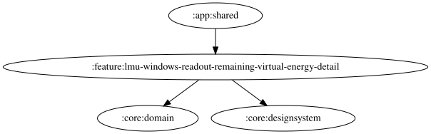

# lmu-windows-readout-remaining-virtual-energy-detail

LMU のバーチャルエナジー残量を読み上げる機能の詳細設定画面。バーチャルエナジー残量が設定した閾値（10〜90%、デフォルト30%）以下になったタイミングで警告を読み上げる。文言入力欄で自由文言を設定し、`{percent}` を設定した残量閾値（%）に置換して OS 標準TTSで読み上げる。挿入チップで `{percent}` を追加でき、試聴ボタンでは現在の閾値を使って開始音の後に文言を再生する。文言と閾値スライダーの設定値は DataStore に永続化される。空白文言・TTS利用不可では読み上げず、WAVにはフォールバックしない。試聴時の音量がゼロ以下の場合も開始音・本文を再生しない。

「残量閾値」はバーチャルエナジーの残量割合（%）に対する閾値を指します。

<!-- MODULE-GRAPH-START -->
## Module Dependencies

<!-- MODULE-GRAPH-END -->
