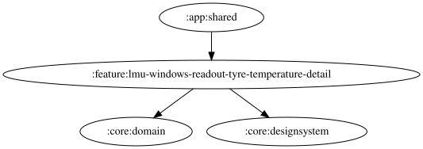

# lmu-windows-readout-tyre-temperature-detail

過熱・低温警告の自由文言は `{celsius}` に対応する。実際の読み上げでは、警告判定時の全輪の最高カーカス温度を四捨五入した整数（℃）に置換する。低温警告も最高温度を使い、`{wheel}` は未対応。

挿入チップは入力末尾へ `{celsius}` を追加し、文字数上限を超える場合とTTS利用不可時は無効になる。未知のプレースホルダーは警告を表示し、そのまま読み上げる。試聴は過熱では選択中車両クラスの高温閾値（スライダーの現在値）、低温では60℃固定を使い、空白・TTS利用不可・音量ゼロ以下では再生しない。既定文言は「タイヤ過熱 {celsius}度」「タイヤ低温 {celsius}度」。DataStore の保存済み文言は変更せず、未設定の場合と「デフォルトに戻す」操作で新しい既定文言を使用する。DataStore の移行は不要。

Narrator は判定時に解決した本文を `resolvedText` に保持し、キュー待機中の設定変更で発話とログがずれることを防ぐ。

<!-- MODULE-GRAPH-START -->
## Module Dependencies

<!-- MODULE-GRAPH-END -->
