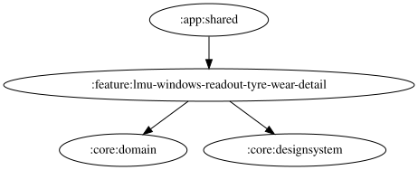

# lmu-windows-readout-tyre-wear-detail

LMU のタイヤ摩耗警告の詳細設定画面。いずれかのタイヤの残存率が設定した閾値（10〜90%、デフォルト50%）以下になったときに警告し、全タイヤが閾値を上回るまで再度読み上げない。自由文言の `{percent}` は実際の残存率ではなく設定した残存率閾値（%）に置換し、OS標準TTSで読み上げる。文言・閾値・有効状態は DataStore に永続化する。

文言入力欄は `{percent}` 挿入、未知プレースホルダー警告、30文字の文字数カウンター、「デフォルトに戻す」、試聴を提供する。既定文言は「タイヤ残存率{percent}%以下」。リセットはTTS利用不可または既定文言と同じ場合は無効。試聴は現在のスライダー閾値と編集中の文言を解決した `SpeechEvent.TyreWearWarning` を再生し、`TyreWear.Root` の開始音設定を使用する。空白文言・TTS利用不可・音量ゼロ以下の場合は試聴しない。WAVへのフォールバックは行わない。

「残存率閾値」はタイヤの残存率（%）に対する閾値を指し、摩耗率ではありません。燃料・バーチャルエナジーの「残量閾値」とは計測対象に合わせて表記を区別しています。

試聴の再生条件とTTS利用可否は `:core:domain` の `ReadoutSpeechEventPreviewHelper` で共通化し、文言の解決とイベント生成はViewModelが担当する。

<!-- MODULE-GRAPH-START -->
## Module Dependencies

<!-- MODULE-GRAPH-END -->
