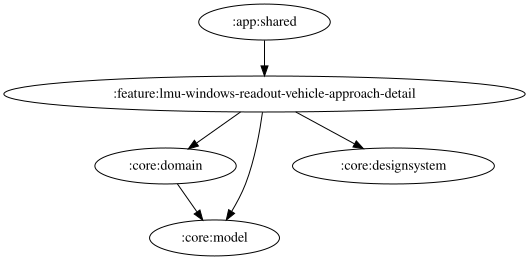

# lmu-windows-readout-vehicle-approach-detail

接近開始時は保存された左右の自由文言を表示し、OS標準TTSで左→右の順に試聴する。左右の編集UIは後続PRで追加する。継続時は既存の収録WAV選択・試聴を維持する。

<!-- MODULE-GRAPH-START -->
## Module Dependencies

<!-- MODULE-GRAPH-END -->
