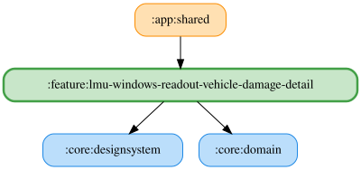

# lmu-windows-readout-vehicle-damage-detail

オーバーヒート・部品脱落・タイヤ脱落の3カードに、それぞれ自由文言の入力欄、デフォルトに戻すボタン、読み上げプレビューを表示する。文言は車両クラスによらず各1つを保存し、既定値は「オーバーヒート」「部品脱落」「タイヤ脱落」。プレースホルダー置換は行わない。

入力は `READOUT_CUSTOM_TEXT_MAX_LENGTH` 文字までで、保存時は前後の空白を除去する。各カードのスイッチOFFでも文言を編集・試聴できる。試聴では編集中の文言を `resolvedText` に持つイベントを再生し、`VehicleDamage.Root` の開始音とOS標準TTSを使う。空白文言・TTS利用不可・音量0以下では再生しない。TTS利用不可時は入力・リセット・試聴を無効にする。収録WAVへのフォールバックは行わない。

文言とスイッチは既存の `LmuWindowsVehicleDamagePreferencesRepository` を使用する。文言の Observe/Save UseCase は `VehicleDamageUseCases`、試聴・TTS利用可否・音量は `VehicleDamageReadoutUseCases` が束ねる。

試聴の再生条件とTTS利用可否は `:core:domain` の `ReadoutSpeechEventPreviewHelper` で共通化し、文言の解決とイベント生成はViewModelが担当する。

詳細ペインを離れたときも試聴を停止する。

<!-- MODULE-GRAPH-START -->
## Module Dependencies

<!-- MODULE-GRAPH-END -->
