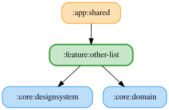

# other-list

Windows/Androidの「読み上げ音声」項目は副テキストに保存済み音声IDを表示する。未指定の場合は「システム既定」を表示する。Androidでもこの項目を一覧に表示する。

「読み上げ開始音」項目の副テキストに選択中の種別「Formula無線」または「電子ノイズ」を表示する。設定の変更に追従して更新する。

「テーマ」項目の副テキストに現在の設定「システムに従う」「ライト」「ダーク」を表示する。設定の変更に追従して更新する。

「音量」項目の副テキストにアプリの音量と端末のマスター音量を整数%で表示する。端末音量は一覧の購読中、2秒ごとに取得して更新する。

<!-- MODULE-GRAPH-START -->
## Module Dependencies

<!-- MODULE-GRAPH-END -->
