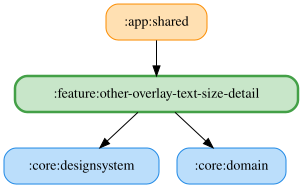

# other-overlay-text-size-detail

その他タブの「オーバーレイ設定」から文字サイズを7段階で選択する。

| 表示名 | `OverlayTextSize` | 保存ID | 文字サイズ |
|---|---|---|---|
| 極小 | `EXTRA_SMALL` | `extra_small` | 14sp |
| 小 | `SMALL` | `small` | 18sp |
| 中（デフォルト） | `MEDIUM` | `medium` | 22sp |
| 大 | `LARGE` | `large` | 28sp |
| 特大 | `EXTRA_LARGE` | `extra_large` | 36sp |
| 超特大 | `HUGE` | `huge` | 48sp |
| 最大 | `MAXIMUM` | `maximum` | 64sp |

既存の保存IDと `OVERLAY_TEXT_SIZE_DEFAULT` は維持し、未知のIDは中へフォールバックする。
文字サイズと約1.3倍の行高は `NarratorOverlayContent` のUI側で定義し、ドメインのenumには含めない。

<!-- MODULE-GRAPH-START -->
## Module Dependencies

<!-- MODULE-GRAPH-END -->
