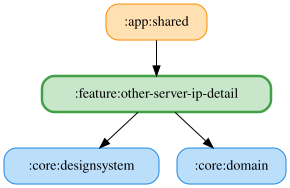

# other-server-ip-detail

LMU Windows 版デスクトップアプリ（`:server`）の接続先IPアドレスを設定する画面を提供する feature モジュール。`:server` の `KoDriverServer.start()` が mDNS（`_kodriver._tcp.local.`）でLAN内へ広告するサーバーを検出し、接続先IPの自動入力に使う（詳細は CLAUDE.md の「Ktor サーバー」節を参照）。

## 主要なファイルの役割

- `OtherServerIpDetailPane.kt`: IPアドレス設定画面のUI。
- `OtherServerIpDetailViewModel.kt` / `OtherServerIpDetailUiState.kt`: 入力中のIPアドレス、バリデーション結果、疎通確認結果などの画面状態。
- `WindowsServerDiscovery.kt`: mDNSによるサーバー検出のインターフェース。プラットフォームごとの実装（`PlatformWindowsServerDiscovery.*.kt`）は expect/actual で分離。
- `OtherServerIpDiscoveryDialog.kt`: 検出したサーバー一覧から選択するダイアログ。
- `DiscoveredServer.kt`: mDNSで検出したサーバーの表示名と接続先IPアドレスを保持するデータクラス。
- `ValidateServerIpAddressUseCase.kt`: 入力されたIPアドレス文字列の形式検証。
- `ServerConnectivityChecker.kt`: 指定したIPアドレスへの疎通確認。プラットフォームごとの実装は expect/actual で分離。
- `SaveServerIpWithConnectivityCheckUseCase.kt`: 疎通確認を行った上でIPアドレスを保存するUseCase。
- `OtherServerIpDetailModule.kt`: この feature の Koin モジュール定義。
- `ErrorCapture.kt`: プラットフォームごとのエラーレポート送信（expect/actual）。

<!-- MODULE-GRAPH-START -->
## Module Dependencies

<!-- MODULE-GRAPH-END -->
